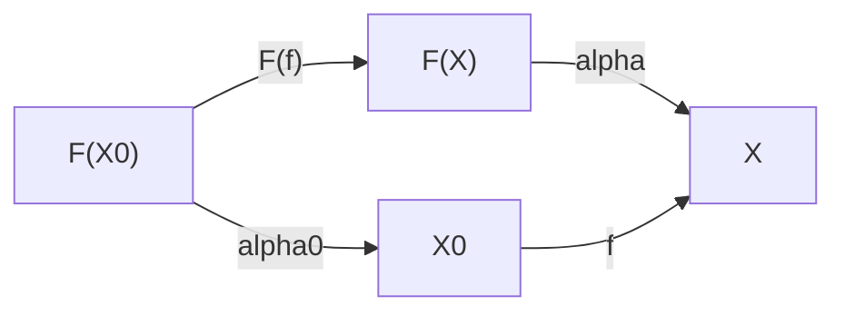

## Everything has a type

[← Index](00-index.md) | [Next: `def`, `let`, implicit arguments →](02-def-let-implicit.md)

---

This is the first question the whole book will keep coming back to.
Before anything can be proved, or even run, Lean needs to know *what kind
of thing* every piece of a program or proof is. "Everything has a type"
is the slogan; the rest of this section makes it literal.

In Lean 4, every expression (a **term**) has a **type**. A type answers the
question "what *kind* of thing is this?" It could be a number, a boolean, a proof, a
function from numbers to numbers. Lean checks this question *before*
running anything, and it never lets a term of the wrong type slip through.

```lean
#check 3          -- 3 : Nat
#check -3         -- -3 : Int
#check Nat        -- Nat : Type
#eval 2 ^ 10        -- 1024 (evaluates; #check only elaborates)
```

**Mathematical reading.** The basic unit of assertion in type theory is the
**judgment**, a statement made *about* an underlying formal system, called
the **calculus**, from the outside, not a proposition proved *inside* it.
For Lean, this calculus is made concrete a few sentences below as the
$\lambda$-calculus, and named precisely as the **calculus of
constructions** in [Chapter 1, Section 5](05-pi-sigma-and-coc.md). Nothing here
depends on that name yet. Following Martin-Löf, the judgment used here has
the form $e : \tau$, read "$e$ is a term of type $\tau$," adapted to
the colon notation used by Lean. The original text by Martin-Löf writes the same judgment as
$a \in A$ ("$a$ is an element of the set $A$"), set-membership notation
rather than a colon, though the judgment being made is the same one. For
example,
$3 : \mathtt{Nat}$ is one such judgment. It asserts, from outside the
calculus, that the term $3$ has type $\mathtt{Nat}$, not a fact proved
*by* the calculus, but a fact established *about* it, the same way the
output of a type-checking algorithm is a claim about a program, not a
theorem proved inside the program. `#check e` asks Lean to establish
exactly this kind of judgment for a given `e`, and it is literally the
same typing judgment used in a lecture on the simply-typed (or
dependently-typed) $\lambda$-calculus.
$3 : \mathtt{Nat}$, ${-3} : \mathtt{Int}$, $\mathtt{Nat} : \mathtt{Type}$.
`#eval e` instead asks Lean to reduce $e$ to a normal form. This is the
computational content of $\beta$-reduction. Lean follows the definitional
equalities until nothing more can fire, exactly as one would normalize a
term in $\lambda$-calculus by hand. Both "normal form" and
"$\beta$-reduction" receive a full treatment in
[Chapter 1, Section 4](04-terminology.md) for readers meeting them for the first
time. Briefly, each denotes the value obtained after fully
simplifying/running the expression, nothing more exotic.

Read `#check 3` as "Lean answers the question `3 : ?` with `Nat`." Read
`#check Nat` as "even `Nat` itself, the type of natural numbers, is a
term, and *its* type is `Type`." This is the first surprising fact worth
sitting with. Types are not a separate kind of thing bolted onto a
programming language. In Lean, a type is itself a term, and it has a type
of its own (`Type`), the same way `3` has a type (`Nat`). This is what
"everything has a type" means literally, not just for ordinary values.

`#check e` answers the question "what type does `e` have?" without running
`e`. `#eval e` actually runs `e` and prints the result. These are
deliberately two different commands, since they answer two different
questions.

- `#check` is a **static** guarantee. It holds before any particular
  input is supplied, for every possible run.
- `#eval` is a **one-off fact**, the result of running this *particular*
  expression, right now.

**Programmer's corner (Python).** For readers who have written Python but
not Lean, `#check e` is *not* `type(e)`. The `type()` function in Python asks a running
value what class it happens to belong to, after the fact. The `#check` command in Lean
is closer to what a static type checker like `mypy` does with an
annotation such as `x: int = 3`. It verifies, *before* anything runs, that
the expression could only ever produce a value of the stated type. `#eval
e`, on the other hand, *is* just `print(e)`. Run it, show the result. Lean
separates these two commands for the same reason `mypy` exists at all.
Type-checking is a static guarantee that holds for every possible input,
while evaluating is a one-off fact about this particular expression.
The `int` type in Python has no genuine analogue of `Nat`. The `int` type in Python is signed and never
checked against a "must be non-negative" rule, except by an explicit
runtime `if` statement. `Nat`, by contrast, bakes non-negativity into the
type itself, checked once, statically, for every use site. This is closer
to a language with a genuine `unsigned` type (C, Rust) than to Python.

### Why this matters: types rule things out in advance

Here is the entire point of a type system, made concrete. This starts in
Python, where the failure can actually be watched happening, before seeing
how Lean rules it out instead.

```python
# Python: this line is perfectly legal to *write*.
def add_them(a, b):
    return a + b

add_them(3, True)    # 4 — Python silently treats True as 1, no error at all
add_them(3, "oops")  # TypeError: unsupported operand type(s), but only once this exact line runs
```

Nothing stops Python from *writing* `add_them(3, "oops")`. The mistake is
only discovered the moment that specific line executes. If it sits on a
rarely-hit branch, it can ship for months undetected. And in the `True`
case, Python does not even complain. It quietly coerces the boolean to `1`
and moves on, whether or not that was the intended meaning.

Now the same shape of mistake in Lean:

```lean
#check 3 + true   -- error: failed to synthesize HAdd Nat Bool ?m
```

Lean refuses to even *elaborate* this expression. It never runs it, never
silently coerces `true` to `1`, never crashes five function calls later
once the bad value finally reaches code that cannot handle it. It simply
never accepts the term in the first place, because the left argument of `+` is
a `Nat` and the right argument is a `Bool`, and no rule connects the two.
The check happens once, by reading the expression, without running it on
any input. The guarantee Lean gives is stronger than what Python gives. Once a term
type-checks, this entire class of runtime error is impossible for that
term, on *every* input, not just the ones a test suite happened to run.

### `Nat`, concretely

`Nat` is not a built-in primitive the way `int` is in most languages. It is
defined, in full, as an **inductive type**:

$$
\mathtt{Nat} ::= \mathtt{zero} \mid \mathtt{succ}\,(n : \mathtt{Nat})
$$

Read this as "a `Nat` is built in exactly one of two ways. It is `zero`,
or it is `succ n` for some already-built `Nat` called `n`." This is exactly
the definition given by Peano, written out precisely. So `3` is not a primitive digit. It is
shorthand for `succ (succ (succ zero))`. Confirm it directly:

```lean
#eval Nat.succ (Nat.succ (Nat.succ Nat.zero))  -- 3
```

Lean prints numerals for readability, but underneath, every `Nat` really is
built from nothing but `zero` and `succ`, the same way every natural number
in a first course in logic is built from the axioms of Peano. This inductive
shape is exactly what licenses proof by induction later (Chapter 4). To
prove something about *every* `Nat`, it suffices to prove it for `zero` and
show it is preserved by `succ`, because those are, provably, the only two
ways a `Nat` can ever have been built.

> **Mathematical reading (optional, for readers who already know some
> category theory).** Regard `Type` as a category. Its **objects** are
> types, `α`, `β`, and so on (this is the convention used throughout the book, spelled out
> fully in [Chapter 1, Section 2](02-def-let-implicit.md)), and its **morphisms** are
> functions. A function `f : α → β` is a morphism from `α` to `β`, *not*
> a functor (a functor maps *between* categories; `Type` is the only
> category in sight here, and `α` and `β` are two of its objects, not
> categories in their own right). A term `x : α` is an element of the
> object `α`. `fun x => x` is the identity morphism, and `∘` is genuine
> categorical composition. Associativity and the identity laws hold
> *definitionally*, checked by Lean at no extra cost.
>
> **Statement of the result.** `Nat` is generated by a base case
> (`zero`) and a step (`succ`), and by nothing else. Category theory
> gives a precise sense in which `Nat` is the smallest structure with
> this shape, and this precision is what justifies proof by induction.
> The argument below is given first in general terms, for an arbitrary
> type $X$, and only afterward specialized to `Nat` itself. The two
> notations are kept separate on purpose, to avoid mixing the general
> statement with its particular instance.
>
> **1. The general statement, for an arbitrary type $X$.** Let
> $F(X) = 1 + X$, an **endofunctor** on `Type` (here $1$ denotes a
> one-element type and $+$ denotes *disjoint sum*. These correspond to
> the Lean types
> [`Unit`](https://leanprover-community.github.io/mathlib4_docs/Init/Prelude.html#Unit)
> and
> [`Sum`](https://leanprover-community.github.io/mathlib4_docs/Init/Core.html#Sum),
> and this $+$ is distinct from the numeric $+$ introduced later in this
> box, notation notwithstanding). For an arbitrary endofunctor $F$, an
> **$F$-algebra** is a type $X$
> equipped with a map $F(X) \to X$. By the universal property of $+$, a
> map $(1 + X) \to X$ is equivalent to a pair consisting of an element
> $z : X$ and a self-map $s : X \to X$. Here $z$ stands for "zero component,"
> chosen to
> avoid the symbol $e$ conventionally used for the identity element of a monoid. An $F$-algebra is therefore equivalent to a triple $(X, z, s)$. A
> **morphism** of $F$-algebras from $(X, z, s)$ to $(Y, z', s')$ is a
> function $f : X \to Y$ satisfying $f(z) = z'$ and $f(s(x)) = s'(f(x))$
> for every $x$, i.e. a function compatible with both components of the
> algebra structure. Among all $F$-algebras there is an
> **initial object**, an algebra
> $(X_0, z_0, s_0)$ such that, for every algebra $(X, z, s)$, there
> exists exactly one algebra morphism from $(X_0, z_0, s_0)$ to
> $(X, z, s)$. The algebra maps themselves are $\alpha_0 : F(X_0) \to X_0$
> (the pair $(z_0, s_0)$, packaged as one map by the universal property of
> $+$ above) and $\alpha : F(X) \to X$ (the pair $(z, s)$). The initiality
> condition is exactly that $f$ makes the algebra-morphism square below
> commute. Applying the algebra map first and then $f$, or applying
> $F(f)$ first and then the algebra map, must agree (the diagram itself
> follows this box, once all the notation is in place).
>
> **2. Specializing to `Nat`.** Set $X_0 := \mathtt{Nat}$,
> $z_0 := \mathtt{zero}$, $s_0 := \mathtt{succ}$. This triple is an
> $F$-algebra, and it is in fact the initial one. For every algebra
> $(X, z, s)$, there exists exactly one algebra morphism from `Nat`,
> determined uniquely by sending `zero` to $z$ and `succ n` to $s$
> applied to the image of `n`. From here on the discussion stays with
> `Nat`, `zero`, and `succ`. The general letters $X$, $z$, $s$ have done
> their job and will not reappear.
>
> **3. Consequence for induction.** The uniqueness established in Step 2
> is precisely the universal property that justifies structural
> induction. To define a function, or establish a statement, for every
> `Nat`, it suffices to specify the base case at `zero` and the inductive
> step at `succ`, since this data already determines the unique algebra
> morphism from `Nat`, and defining a function on `Nat` (or proving a
> statement about it) amounts to specifying such a morphism. This
> construction is known in the literature under two equivalent names,
> **initial algebra** and **natural numbers object** of `Type`.
>
> **A second, different fact, worth not conflating with the above.**
> None of this is required to use `Nat`. It is offered only because,
> once ordinary numeric `+` and `0` are *defined* on `Nat` (Chapter 4),
> an entirely different operation from the disjoint-sum $+$ used to
> build $F$ above, despite sharing a symbol, a second and different
> fact becomes provable (not merely definitional). `Nat`, with this
> numeric `+` and `0`, is the free commutative monoid on one generator.
> This is a genuinely different universal property from the
> initial-algebra one above. The two are easy to conflate, since both
> attach the word "universal" to `Nat`, but one concerns $F$-algebras and
> the other concerns monoids. [Chapter 1, Section 4](04-terminology.md) fixes the
> vocabulary ("universal property," "initial object") used here, for any
> reader meeting it for the first time.

Here is the general algebra-morphism square the box above refers to. The
initiality condition is exactly that the two paths around this square
agree, for the unique $f$ from the initial algebra $(X_0, \alpha_0)$ to
any other algebra $(X, \alpha)$.



---

### Sources, quoted

Formal definitions and citations for this section, gathered here for
reference (full entries in the [Bibliography](../bibliography.md)):

- **Judgment.** "A statement made about a calculus from the outside,
  not a proposition proved inside it" ([MartinLof1984], Ch. 1,
  "Judgements and their explanations," working
  statement used by this book). Picture it like this. It is a label, not a proof, the same way a customs
  officer stamping "fruit" on a crate is stating a fact about the crate
  from outside it, not proving anything the fruit itself has to argue
  for. $e : \tau$ is that stamp. `3 : Nat` says "3 belongs in the `Nat`
  bin," decided once, from the outside, before anything runs.
- **Type system guarantee.** "A type system is a tractable syntactic
  method for proving the absence of certain program behaviors..."
  ([Pierce2002], §1.1–§1.2). Picture it like this. An airport security scanner
  that checks every bag before boarding, rather than waiting to see
  which bags cause trouble mid-flight. A whole category of problem
  (guns, in that analogy; passing a boolean where a number belongs, in
  this one) is caught once, at the gate, for every passenger, instead of
  discovered one incident at a time.
- **$F$-algebra.** "For an arbitrary endofunctor $T : \mathbb{B} \to
  \mathbb{B}$ [on a category $\mathbb{B}$] an algebra (or
  $T$-algebra) consists of a 'carrier' object $Y \in \mathbb{B}$
  together with a morphism $\varphi : T(Y) \to Y$" ([Jacobs1999],
  §2.6, p. 161; $F$ is written here for the $T$ used by Jacobs). Picture it like
  this. A recipe that only ever uses ingredients already sitting in the
  kitchen and produces a dish that goes back into that same kitchen,
  never fetching anything from outside, never producing something that
  needs a different kitchen. $F(X) \to X$ is exactly that closure
  property, stated once for any "kitchen" $X$ and any "kind of recipe"
  $F$.
- **Initial object.** "An object $s$ is initial in a category $C$ if
  to each object $a$ of $C$ there is exactly one arrow $s \to a$"
  ([MacLane1998], Ch. I §5, p. 20). Picture it like this. A single train station
  that has exactly one direct route to every other station on the
  entire map, and no other station has that property. "Initial" means
  uniquely, unambiguously first.
- **Natural numbers object (NNO).** "In a category with finite
  products a natural numbers object (NNO) consists of a zero and
  successor diagram $1 \xrightarrow{0} N \xrightarrow{S} N$ which is
  initial in the sense that for an arbitrary diagram of the form
  $1 \xrightarrow{x} X \xrightarrow{g} X$ there is a unique
  $h : N \to X$ making the diagram commute" ([Jacobs1999], §2.6,
  p. 159; in functional notation, $h(0) = x$ and $h(Sn) = g(hn)$).
  Picture it like this. A staircase, one bottom step (`zero`) and a rule for
  building the next step from the one before it (`succ`). `Nat` is the
  staircase built from nothing but that rule, and it is the *only* such
  staircase up to relabeling. Any other structure with a "start" and a
  "next step" rule can be reached from the staircase of `Nat` in exactly one
  way, step for step. That uniqueness is exactly why "check the bottom
  step, then check that each step implies the next" (ordinary induction)
  is enough to cover every step there is.
- Lean 4 documentation, "Basic Types," and *Theorem Proving in Lean 4*, §2.1 "Simple Type Theory" ([LeanDocs], [TPIL4]) covers the `#check`/`#eval` distinction and `Nat` as an inductive type.

[LeanDocs]: ../bibliography.md#leandocs
[TPIL4]: ../bibliography.md#tpil4
[MartinLof1984]: ../bibliography.md#martinlof1984
[Pierce2002]: ../bibliography.md#pierce2002
[MacLane1998]: ../bibliography.md#maclane1998
[Jacobs1999]: ../bibliography.md#jacobs1999

---

[← Index](00-index.md) | [Next: `def`, `let`, implicit arguments →](02-def-let-implicit.md)
