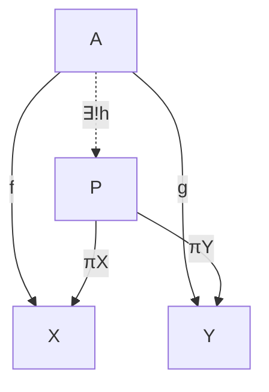
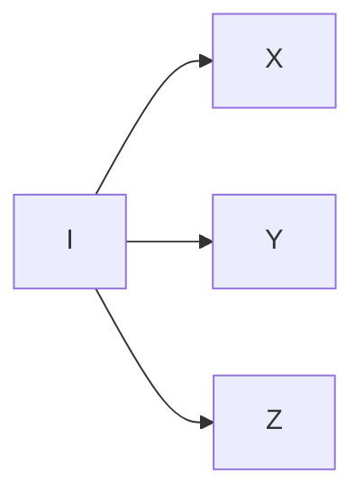
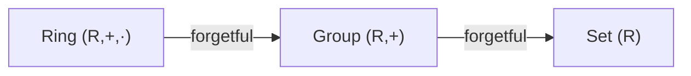
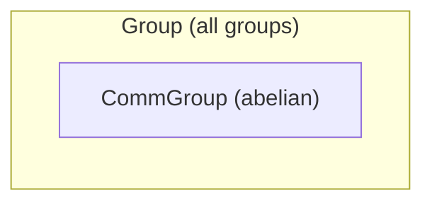

## Terminology encountered before it is fully explained

[← Dependent types, with examples](03-dependent-types.md) | [Index](00-index.md) | [Next: Π/Σ-types and the calculus of constructions →](05-pi-sigma-and-coc.md)

---

Four words are going to come up constantly from here on, well before this
book gives any of them a full formal treatment. Rather than leave these
words undefined until they are needed, here is a working definition of
each, good enough to use right away, with pointers to where a fuller
formal treatment lives — [§5 of this chapter](05-pi-sigma-and-coc.md) for
Π/Σ-types and the calculus of constructions, [Chapter 3
§2](../03-propositions-and-proofs/02-logic-recap.md) for the logic
underneath Curry–Howard, and [Chapter 5
§3](../05-rigor-check/03-typing-rules-and-safety.md) for typing rules and
why Lean's guarantees can be trusted.

### Elaborate / elaboration

This is the process by which Lean turns the surface syntax written by the
user into a fully-explicit, fully-typed internal term: filling in implicit
arguments, resolving notation, checking every subterm's type against
what is expected. When this book says an expression "elaborates to"
something, it means "after Lean has finished this filling-in process, the
result is..." For example, `identity 5` *elaborates to*
`@identity Nat 5` (Chapter 1), with `α := Nat` filled in silently.
Elaboration is not guessing: it is **type inference for the calculus of
constructions** ([§5](05-pi-sigma-and-coc.md) makes this system precise),
a deterministic algorithm driven by that calculus's own typing rules, not
black-box compiler behavior. Every "Lean figures it out from context"
moment since the very first `identity 5` is this same algorithm at work.

### Unify / unification

This is the specific step inside elaboration that solves
"what must this placeholder be, given what I already know?" When Lean
sees `identity 5` and knows `identity : {α : Type} → α → α`, it *unifies*
the type of `5` (namely `Nat`) with the placeholder `α`, concluding
`α := Nat`. Unification is what makes implicit-argument inference
(Chapter 1), `apply`'s subgoal-matching (Chapter 4), and typeclass
instance search (Chapter 5) all work. In each case, Lean is solving an
equation between two (possibly partially unknown) terms — a
well-understood, terminating (for the fragment Lean actually uses)
procedure, not an oracle. When it fails, the resulting error message
(Chapter 4, "reading a tactic failure") states specifically which
unification equation could not be solved.

> **Tactics do not add anything to the underlying calculus.** Every tactic
> from Chapter 4 onward ([`intro`](https://lean-lang.org/doc/reference/latest/Tactic-Proofs/Tactic-Reference/), [`exact`](https://lean-lang.org/doc/reference/latest/Tactic-Proofs/Tactic-Reference/), [`rw`](https://lean-lang.org/doc/reference/latest/Tactic-Proofs/Tactic-Reference/), [`induction`](https://lean-lang.org/doc/reference/latest/Tactic-Proofs/Tactic-Reference/), ...) is a
> *user interface* for building terms of this same calculus step by step,
> with the goal state showing the type of the "hole" still to be filled.
> Every finished tactic proof elaborates to an ordinary term that could
> have been written by hand; running `#print` on any tactic-proved theorem
> shows the literal term the tactic script built.

### Reduce / reduction, normal form

A term **reduces** by repeatedly applying its computation rules:
substituting an abstraction's argument into its body (β-reduction),
unfolding a `def`, or simplifying a `match` on a known constructor. A term
with no more reductions available is in **normal form**. `#eval`
(Chapter 1) computes a term's normal form and prints it. `rfl` (Chapter 3)
succeeds exactly when both sides of an equation share a normal form. In
practice, Lean's kernel usually only reduces as far as it needs to
progress: down to **weak head normal form** (far enough to see the
outermost constructor or function head), not necessarily all the way
down. This is why, for example, `Nat.add`'s recursion on its *second*
argument (Chapter 4) determines which side of an equation reduces "for
free" and which needs an explicit inductive argument. Lean only unfolds
`a + b` far enough to expose `b`'s shape, so `a + 0` reduces immediately
(the second argument is already the base case), while `0 + a`, with an
unknown `a` in the position `Nat.add` recurses on, does not reduce at all
until `a` itself is known.

**Where β-reduction comes from, precisely.** Every `fun x => ...` in this
book compiles down to one small formal system, the **λ-calculus**: a
variable `x`, an abstraction `fun x => t` (written $\lambda x.\, t$), or
an application `t1 t2`, and nothing else — no built-in numbers, booleans,
`if`, or recursion; every one of those is *encoded* as a term built from
these three constructs alone. In $\lambda x.\, t$, occurrences of `x`
inside `t` are **bound**; any other variable is **free** — exactly Lean's
ordinary lexical scoping. Two abstractions differing only in a bound
variable's name (`fun a => a` vs. `fun x => x`) are considered the *same*
term (**α-conversion**); Lean's elaborator treats them as interchangeable
without comment. The one computation rule, **β-reduction**, is applying an
abstraction to an argument by substitution:
$$
(\lambda x.\, t)\, s \;\longrightarrow_\beta\; t[x := s]
$$
— precisely definitional equality's engine: `(fun x => x * 2) 5` reduces,
by exactly this rule, to `5 * 2`. Every abstraction takes exactly *one*
argument; a "two-argument function" `fun x y => t` is really `fun x => fun
y => t`, a function returning a function — this is **currying**, why
`Nat → Nat → Nat` is genuinely `Nat → (Nat → Nat)`, one argument at a
time, with no separate multi-argument mechanism underneath. Finally, the
**Church–Rosser theorem** guarantees that if a term has several possible
next reduction steps, reducing them in any order that terminates reaches
the *same* normal form — the theoretical bedrock under never having to
worry that elaborating an expression "the wrong order" gives a different
answer than "the right order."

**Worked example.** Reduce $(\lambda x.\, \lambda y.\, x)\, a\, b$
(application associates to the left, so this is
$((\lambda x.\, \lambda y.\, x)\, a)\, b$):
$$
(\lambda x.\, \lambda y.\, x)\, a\, b
\;\longrightarrow_\beta\; (\lambda y.\, a)\, b
\;\longrightarrow_\beta\; a
$$
The first step substitutes $a$ for $x$ in $\lambda y.\, x$, giving
$\lambda y.\, a$ — note $a$ is now *free* inside this abstraction, since
the original body never mentioned $y$ at all. The second step substitutes
$b$ for $y$ in a body that does not mention $y$, so it simply discards
$b$ and leaves $a$. This particular term — $\lambda x.\, \lambda y.\, x$,
"take two arguments, return the first, discard the second" — is important
enough to have its own name, $K$, and it becomes `Bool.true`'s
implementation once booleans are encoded this way (as in Chapter 13's
Church-encoding aside).

> **Programmer's corner (Python).** Python's own `lambda` really does
> β-reduce exactly like the calculus above on simple examples —
> `(lambda x: x + 1)(5)` reduces to `5 + 1` to `6`, the same substitution
> step as $(\lambda x.\, x + 1)\, 5 \to_\beta 5 + 1$ — but Python's
> `lambda` is a deliberately limited subset: its body must be a single
> *expression*, no `if`/`for`/multiple statements. The actual untyped
> λ-calculus has no such restriction, because none is needed: conditionals
> and recursion are just more terms built from abstraction and
> application, not separate features bolted on top. Lean's `fun` matches
> the unrestricted calculus, not Python's narrower `lambda`.

Chapter 1 §5 extends exactly this calculus with dependent types (Π/Σ,
universes) to reach the system Lean's kernel actually runs — the
**calculus of constructions**.

### Motive

This is the (possibly type-dependent) predicate or type family that a
tactic like `induction` or `rw` is secretly generalizing the goal over
before it operates. When `rw [h]` fails with **"motive is not type
correct,"** the meaning is as follows: to replace one side of `h` with the
other throughout the goal, Lean first abstracts the goal into a function
`C` (the motive) taking the rewritten term as a parameter. Here, that
abstraction produces an ill-typed `C`, typically because the term being
rewritten appears inside a dependent type's *index* (as in Chapter 11's
`Path`, whose very type depends on specific vertices) rather than in a
position that can vary freely. The fix is almost always to restate the
goal first with `show`, or to generalize the index explicitly, so the
motive Lean builds is well-typed.

> Read more: [Chapter 5 §4](../05-rigor-check/04-defeq-vs-propeq.md)
> revisits "motive is not type correct" alongside definitional equality;
> [§5 of this chapter](05-pi-sigma-and-coc.md) shows the recursor/eliminator
> (e.g. `Nat.rec`) whose own type is literally parameterized by a motive,
> which is where the name comes from.

### Category-theory terms used beyond the baseline

The README states that the only category theory assumed going in is
"objects, morphisms, composition, functors," which holds true of the main
text. The optional "Mathematical reading" boxes scattered through later
chapters occasionally go one step further, for readers who already possess
a bit more category theory and would appreciate the extra precision. Four
such terms come up often enough to be worth fixing once here, so every
later use can simply point back to this entry instead of re-explaining
(or, worse, silently assuming) each time:

#### Universal property

This is a characterization of a construction not by what it is *made of*,
but by what maps *uniquely factor through it*. "$X$ has property $U$"
means "for every $Y$ with the relevant data, there is exactly one map
$Y \to X$ compatible with that data." This is the category-theorist's way
of saying "$X$ is the *best possible* solution to a mapping problem," and
it is the same idea as the familiar universal properties of products,
quotients, and free constructions from an algebra course; nothing new is
meant by the phrase here beyond that. Here is the classic picture, for a
product $X \times Y$: given any $A$ with maps to both factors, there is
exactly one map into the product making everything agree (the dashed
arrow):

| Symbol | Lean |
| --- | --- |
| $A$, $X$, $Y$, $P$ ("the objects") | types `A`, `X`, `Y`, `X × Y` |
| $f$, $g$ ("the given maps") | ordinary functions `f : A → X`, `g : A → Y` |
| $\exists!$ ("there exists a unique") | — no single token; witnessed by supplying `h` and proving it is the only one |
| $h$ ("the mediating map") | `fun a => (f a, g a) : A → X × Y` |
| $\pi_X, \pi_Y$ ("the projections") | `Prod.fst`, `Prod.snd` (`.1`/`.2`, or `.fst`/`.snd`) |

Read the diagram as follows: the two solid outer arrows ($f$
and $g$) are *given*. The universal property *asserts* the dashed middle arrow $h$
exists, is unique, and makes both triangles commute: $\pi_X \circ h = f$
and $\pi_Y \circ h = g$, i.e. `h a |>.1 = f a` and `h a |>.2 = g a` for
every `a`. "Commute" just means any two paths between the same two
objects in the diagram compose to the same map. This is exactly what
`⟨_, _⟩` does for `Pair`/`structure` types (Chapter 2 §1): give it an
`f`-shaped piece and a `g`-shaped piece, and it hands back the unique `h`
combining them.

#### Initial object

This is an object $I$ of a category with a *unique* morphism
$I \to X$ out to every other object $X$: the universal property above,
specialized to "the best possible source":

| Symbol | Lean |
| --- | --- |
| $I$ ("the initial object") | `Nat` (in `Type`) or `ℤ` (in `Ring`) |
| $I \to X$ ("the unique arrow") | for `Nat`: `Nat.rec` — build a value of *any* `X` by giving a `zero` case and a `succ` case, and that recipe is forced by `Nat`'s two constructors, with no other choice possible |

Exactly one arrow leaves $I$ for every object in the category — never
zero (there is always a map), never more than one (no choice about which).
`Nat` ([Chapter 1 §1](01-everything-has-a-type.md)) and
`ℤ` in `Ring` (Chapter 8) are both flagged as initial objects of the
relevant category in this sense: any structure-preserving map out of them
is forced, with no choice involved.

#### Forgetful functor

This is a functor that takes a structure and *keeps only
part of it*, discarding the rest. Examples: the map sending a group $G$ to
its underlying set (forgetting the multiplication), or a `Ring` to its
underlying `Group` under addition (forgetting multiplication and its
unit):

| Symbol | Lean |
| --- | --- |
| `Ring` $\to$ `Group` ("forgets $\cdot$") | `r.toGroup` (or `r.toAddGroup`, depending on naming) for `r : Ring R` |
| `Group` $\to$ `Set` ("forgets $+$") | `g.carrier`, or simply treating `G : Type` as its own underlying set |

Each arrow keeps *less* structure than the one before it. A `Ring`
remembers both operations, the `Group` it maps to remembers only
addition, and the `Set` it maps to remembers only the underlying elements.
In this book, every `.toGroup`/`.toAddGroup`-style field generated by
Lean's `extends`
([Chapter 2 §3](../02-functions-and-structures/03-extending-structures.md)
onward) *is* a forgetful functor,
computationally: it is the projection that keeps some of a structure's
data and drops the rest.

#### Subobject / full subcategory

A subobject of $X$ is (informally) "a
subset of $X$ cut out by some condition, remembered together with its
inclusion into $X$." For example, `CommGroup` is a subobject of `Group`'s
data, cut out by the extra commutativity axiom:

| Symbol | Lean |
| --- | --- |
| $\subseteq$ ("subobject inclusion") | `structure CommGroup (G) extends Group G where comm : ...` |
| $\iota$ ("the inclusion map") | `.toGroup`, the field `extends` generates automatically |

A full subcategory is the category formed by all objects satisfying such
a condition, together with *all* morphisms between them inherited
unchanged from the ambient category. (Nothing is removed at the morphism
level, only at the object level.) For example, abelian groups form a full
subcategory of all groups.

These four are the ones worth fixing once. If a "Mathematical reading" box
elsewhere uses a still-more-specialized term (adjunction, biproduct, a
presheaf category, and the like), treat it as genuinely optional bonus
content for readers who already know it. Nothing later in the book
depends on it, and the surrounding plain-English explanation always stands
on its own without it.

---

[← Dependent types, with examples](03-dependent-types.md) | [Index](00-index.md) | [Next: Π/Σ-types and the calculus of constructions →](05-pi-sigma-and-coc.md)
