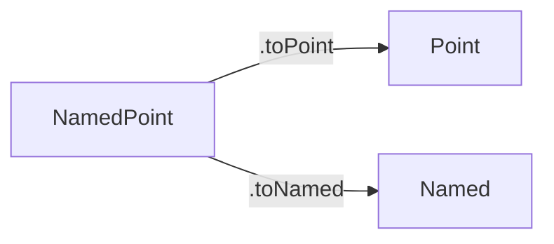

## Extending structures

[← Type parameters](02-type-parameters.md) | [Index](00-index.md)

---

The previous section parameterized a `structure` by a type, so `Pair α β`
was really a whole family of structures, one per choice of `α` and `β`.
Parameterizing by a type is not the only way to grow a structure, though:
sometimes what is wanted is not a new type slotted in, but an *entirely
new field* added on top of a structure that already exists — `Point3D`
needs everything `Point` has, plus a `z` coordinate, without repeating
`x` and `y`'s declarations by hand. `extends` is exactly this: building a
new structure that contains an old one whole, plus more.

```lean
structure Point3D extends Point where
  z : Nat

def origin3D : Point3D := { x := 0, y := 0, z := 0 }

#eval origin3D.x   -- inherited field, 0
```

`extends` is used later: a `CommGroup` (commutative group) will `extend`
`Group` with one extra axiom (commutativity), instead of repeating all the
group fields.

A second single-parent example, extending `Point` a different way:

```lean
structure ColorPoint extends Point where
  color : String

def redOrigin : ColorPoint := { x := 0, y := 0, color := "red" }

#eval redOrigin.x       -- inherited field, 0
#eval redOrigin.color   -- own field, "red"
```

### Extending more than one structure at once

`extends` is not limited to a single parent. `structure C extends A, B`
builds a structure with every field of `A`, every field of `B`, and any
fields declared in `C` itself, generating both `.toA` and `.toB` forgetful
projections:

```lean
structure Named where
  name : String

structure NamedPoint extends Point, Named where
  color : String

def origin3 : NamedPoint :=
  { x := 0, y := 0, name := "origin", color := "black" }

#eval origin3.x            -- from Point, 0
#eval origin3.name         -- from Named, "origin"
#eval origin3.toPoint.x    -- forgetful projection to Point, 0
#eval origin3.toNamed.name -- forgetful projection to Named, "origin"
```

**Field-name collisions.** If two parents both declare a field with the
same name *and* the same type, `extends` merges them into a single shared
field rather than raising an error — `NamedPoint` above has no collision,
but if both `Point` and `Named` had declared an `x : Nat` field, the
resulting structure would have exactly one `x`, filled once, and readable
through either parent's forgetful projection. A collision on the same
field name with *different* types, by contrast, is a genuine error
(`Field type mismatch: Field 'x' from parent 'B' has type String but is
expected to have type Nat`) — Lean does not silently pick one type over
the other or rename either field.

**Mathematical reading.** `structure Point3D extends Point where z : Nat`
is the product $\mathrm{Point3D} = \mathrm{Point} \times \mathbb{N} \cong
\mathbb{N} \times \mathbb{N} \times \mathbb{N}$, together with the
*forgetful map* $\mathrm{Point3D} \to \mathrm{Point}$ (projecting away
$z$), generated automatically as `.toPoint`. In algebraic language, this is
exactly the pattern "a $\mathrm{Point3D}$-structure is a $\mathrm{Point}$-structure
plus one more piece of data." This is precisely how a `CommGroup` will
later be "a `Group`-structure plus one more axiom ($ab = ba$)": a
full subcategory of `Group` cut out by an extra condition, with the
forgetful functor $\mathrm{CommGroup} \to \mathrm{Group}$ being exactly
`.toGroup`.

The multi-parent case above generates two independent forgetful
projections rather than a chain — `NamedPoint` forgets to `Point` and to
`Named` separately, each simply discarding the other parent's fields:



### Sources, quoted

Formal definitions and citations for this section, gathered here for
reference (full entries in the [Bibliography](../bibliography.md)):

- **Forgetful functor.** "A functor which simply 'forgets' some or all
  of the structure of an algebraic object is commonly called a
  forgetful functor (or, an underlying functor). Thus the forgetful
  functor $U : \mathbf{Grp} \to \mathbf{Set}$ assigns to each group
  $G$ the set $UG$ of its elements..." ([MacLane1998], Ch. I §3,
  p. 14). Picture it like this: a company directory that lists only
  names and phone numbers, dropping job titles and departments — the
  underlying people are still there, just stripped of the extra
  structure. `extends` builds a new structure containing everything an
  existing one has, plus more, generating exactly this kind of
  "strip back down" projection (`.toX`) for free.
- Lean 4 documentation ([LeanDocs]) — the auto-generated `.toX` projection produced by `extends`, used above as `origin3D.x` and `.toPoint`.

[LeanDocs]: ../bibliography.md#leandocs
[MacLane1998]: ../bibliography.md#maclane1998

**Key points.** A `structure` bundles data (and optionally proofs) under
one name, built via the anonymous constructor `⟨...⟩` and read back out
via field projection `.field`. `extends` builds a new structure containing
everything an existing one has, plus more, generating a `.toX` forgetful
projection for free — the exact mechanism `CommGroup` uses to add
commutativity to `Group` in Chapter 6.

**Socratic questions.**

1. *`⟨0, 0⟩` and `{ x := 0, y := 0 }` build the identical `Point`. Since
   the named form says more, why does the anonymous form ever get used?*
   Because the *expected type* already says which fields are which —
   `def origin : Point := ⟨0, 0⟩` cannot be ambiguous, since Lean already
   knows a `Point` is being built and in what field order. The named form
   earns its keep only when that context is not enough to make the
   assignment obvious to a reader.
2. *`Point3D extends Point` generates `.toPoint` automatically. What
   would have to be written by hand instead, if `extends` did not
   exist?* A separate function `Point3D.toPoint : Point3D → Point`
   projecting out the shared fields one at a time — exactly what a
   forgetful functor does explicitly, which is the whole reason `extends`
   is read categorically rather than as a mere convenience keyword.
3. *A `structure` can bundle proofs as fields, not only data. What
   changes about *checking* that a term has the right type, once one of
   its fields is a proof rather than a number?* Nothing about the
   mechanism — Lean still checks the field has the stated type — but the
   stated type is now a proposition, so supplying that field means
   supplying a proof, checked once at construction time. This is exactly
   what makes `Group` (Chapter 6) impossible to build carelessly: the
   axiom fields cannot be filled in with nonsense that happens to
   type-check as data can.

## Next

Continue to [Chapter 3: Propositions and proofs](../03-propositions-and-proofs/00-index.md).

---

[← Type parameters](02-type-parameters.md) | [Index](00-index.md) | [Table of contents](../README.md) | [Ch. 3: Propositions & Proofs →](../03-propositions-and-proofs/00-index.md)
