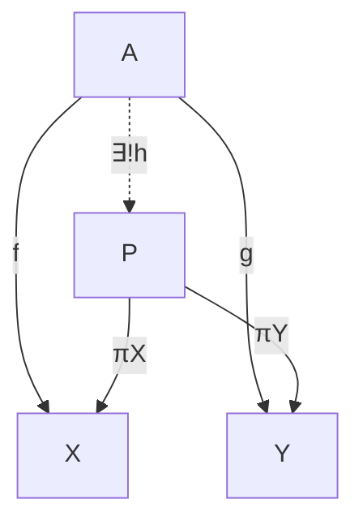
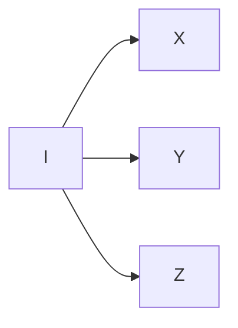
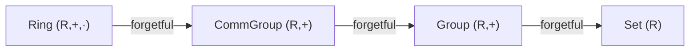
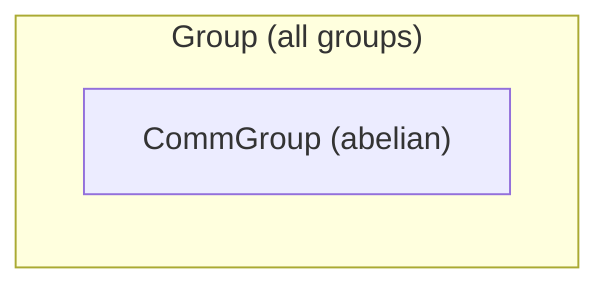

## Terminology encountered before it is fully explained

[← Index](00-index.md) | [Next: Π/Σ-types and the calculus of constructions →](02-pi-sigma-and-coc.md)

---

The last three sections leaned on words like "elaborate," "reduce," and
"bound variable" informally, trusting context to carry the meaning. That
trust runs out here. From this point on, dependent types, then
the logic of Chapter 4, then real proofs, loose use of these words would
start hiding genuine distinctions instead of merely being informal
shorthand. So this section is a deliberate pause, not a new topic. Four
words are going to come up constantly from here on, well before this
book gives any of them a full formal treatment. Rather than leave these
words undefined until they are needed, here is a working definition of
each, good enough to use right away, with pointers to where a fuller
formal treatment lives. [Chapter 2, Section 2](02-pi-sigma-and-coc.md) covers
Π/Σ-types and the calculus of constructions, [Chapter 4,
Section 2](../04-propositions-and-proofs/02-logic-recap.md) covers the logic
underneath Curry–Howard, and [Chapter 6,
Section 3](../06-rigor-check/03-typing-rules-and-safety.md) covers typing rules and
why the guarantees given by Lean can be trusted.

### Elaborate / elaboration

This is the process by which Lean turns the surface syntax written by the
user into a fully-explicit, fully-typed internal term. It fills in implicit
arguments, resolves notation, and checks the type of every subterm against
what is expected. When this book says an expression "elaborates to"
something, it means that after Lean has finished this filling-in process, the
result is that something. For example, `identity 5` *elaborates to*
`@identity Nat 5` (Chapter 1), with `α := Nat` filled in silently.
Elaboration is not guessing. It is **type inference for the calculus of
constructions** ([Chapter 2, Section 2](02-pi-sigma-and-coc.md) makes this system precise),
a deterministic algorithm driven by the typing rules of that calculus itself, not
black-box compiler behavior. Every "Lean figures it out from context"
moment since the very first `identity 5` is this same algorithm at work.

### Unify / unification

This is the specific step inside elaboration that solves
"what must this placeholder be, given what I already know?" When Lean
sees `identity 5` and knows `identity : {α : Type} → α → α`, it *unifies*
the type of `5` (namely `Nat`) with the placeholder `α`, concluding
`α := Nat`. Unification is what makes implicit-argument inference
(Chapter 1), the subgoal-matching done by `apply` (Chapter 5), and typeclass
instance search (Chapter 6) all work. In each case, Lean is solving an
equation between two (possibly partially unknown) terms. This is a
well-understood, terminating (for the fragment Lean actually uses)
procedure, not an oracle. When it fails, the resulting error message
(Chapter 5, "reading a tactic failure") states specifically which
unification equation could not be solved.

> **Tactics do not add anything to the underlying calculus.** Every tactic
> from Chapter 5 onward ([`intro`](https://lean-lang.org/doc/reference/latest/Tactic-Proofs/Tactic-Reference/), [`exact`](https://lean-lang.org/doc/reference/latest/Tactic-Proofs/Tactic-Reference/), [`rw`](https://lean-lang.org/doc/reference/latest/Tactic-Proofs/Tactic-Reference/), [`induction`](https://lean-lang.org/doc/reference/latest/Tactic-Proofs/Tactic-Reference/), ...) is a
> *user interface* for building terms of this same calculus step by step,
> with the goal state showing the type of the "hole" still to be filled.
> Every finished tactic proof elaborates to an ordinary term that could
> have been written by hand. Running `#print` on any tactic-proved theorem
> shows the literal term the tactic script built.

### Reduce / reduction, normal form

A term **reduces** by repeatedly applying its computation rules,
substituting the argument of an abstraction into its body (β-reduction),
unfolding a `def`, or simplifying a `match` on a known constructor. A term
with no more reductions available is in **normal form**. `#eval`
(Chapter 1) computes the normal form of a term and prints it. `rfl` (Chapter 4)
succeeds exactly when both sides of an equation share a normal form. In
practice, the Lean kernel usually only reduces as far as it needs to
progress, down to **weak head normal form**, far enough to see the
outermost constructor or function head, not necessarily all the way
down. This is why, for example, the recursion of `Nat.add` on its *second*
argument (Chapter 5) determines which side of an equation reduces "for
free" and which needs an explicit inductive argument. Lean only unfolds
`a + b` far enough to expose the shape of `b`, so `a + 0` reduces immediately
(the second argument is already the base case), while `0 + a`, with an
unknown `a` in the position `Nat.add` recurses on, does not reduce at all
until `a` itself is known.

**Where β-reduction comes from, precisely.** Every `fun x => ...` in this
book compiles down to one small formal system, the **λ-calculus**. It has
a variable `x`, an abstraction `fun x => t` (written $\lambda x.\, t$), or
an application `t1 t2`, and nothing else. There are no built-in numbers, booleans,
`if`, or recursion; every one of those is *encoded* as a term built from
these three constructs alone. In $\lambda x.\, t$, occurrences of `x`
inside `t` are **bound**; any other variable is **free**, exactly the
ordinary lexical scoping used by Lean. Two abstractions differing only in the name of a bound
variable (`fun a => a` vs. `fun x => x`) are considered the *same*
term (**α-conversion**). The Lean elaborator treats them as interchangeable
without comment. The one computation rule, **β-reduction**, is applying an
abstraction to an argument by substitution:
$$
(\lambda x.\, t)\, s \;\longrightarrow_\beta\; t[x := s]
$$
This is precisely the engine behind definitional equality. `(fun x => x * 2) 5` reduces,
by exactly this rule, to `5 * 2`. Every abstraction takes exactly *one*
argument. A "two-argument function" `fun x y => t` is really `fun x => fun
y => t`, a function returning a function. This is **currying**, and it is why
`Nat → Nat → Nat` is genuinely `Nat → (Nat → Nat)`, one argument at a
time, with no separate multi-argument mechanism underneath. Finally, the
**Church–Rosser theorem** guarantees that if a term has several possible
next reduction steps, reducing them in any order that terminates reaches
the *same* normal form. This is the theoretical bedrock behind never having to
worry that elaborating an expression "the wrong order" gives a different
answer than "the right order."

**Worked example.** Reduce $(\lambda x.\, \lambda y.\, x)\, a\, b$
(application associates to the left, so this is
$((\lambda x.\, \lambda y.\, x)\, a)\, b$):
$$
(\lambda x.\, \lambda y.\, x)\, a\, b
\;\longrightarrow_\beta\; (\lambda y.\, a)\, b
\;\longrightarrow_\beta\; a
$$
The first step substitutes $a$ for $x$ in $\lambda y.\, x$, giving
$\lambda y.\, a$. Note that $a$ is now *free* inside this abstraction, since
the original body never mentioned $y$ at all. The second step substitutes
$b$ for $y$ in a body that does not mention $y$, so it simply discards
$b$ and leaves $a$. This particular term, $\lambda x.\, \lambda y.\, x$,
meaning "take two arguments, return the first, discard the second," is important
enough to have its own name, $K$, and it becomes the implementation of
`Bool.true` once booleans are encoded this way (as in the
Church-encoding aside of Chapter 14).

**A second worked example, applying the identity to itself.** Reduce
$(\lambda x.\, x\, x)\, (\lambda y.\, y)$. This needs *two* β-steps in a
row, each firing on the *outermost* application, unlike the previous
example where the second step fired inside what the first step had just
produced:
$$
(\lambda x.\, x\, x)\, (\lambda y.\, y)
\;\longrightarrow_\beta\; (\lambda y.\, y)\, (\lambda y.\, y)
\;\longrightarrow_\beta\; \lambda y.\, y
$$
The first step substitutes $\lambda y.\, y$ for $x$ in $x\, x$, producing
$(\lambda y.\, y)\, (\lambda y.\, y)$, the identity function applied to
itself. That is itself a new redex, so a second β-step fires, substituting
$\lambda y.\, y$ for $y$ in the body $y$, leaving $\lambda y.\, y$
unchanged, since applying the identity function to any term just returns
that term. The result, $\lambda y.\, y$, is the identity function again.
Applying identity to itself gives back identity.

**A worked example needing α-conversion, not just β-reduction.** Reduce
$(\lambda x.\, \lambda y.\, x)\, y$. Note that the *argument* being substituted
in is itself named $y$, the same name as the inner bound variable. Naive,
purely textual substitution would replace $x$ with $y$ inside
$\lambda y.\, x$ and get $\lambda y.\, y$, but that is *wrong*. It turns
the free $y$ being substituted in into a variable *bound* by the inner
$\lambda y$, silently changing which $y$ is meant (**variable capture**).
Correct, capture-avoiding substitution first α-converts the bound variable
to a fresh name, say $z$, since $\lambda y.\, x$ and $\lambda z.\, x$ are
the same term (α-conversion, as above):
$$
(\lambda x.\, \lambda y.\, x)\, y
\;=\; (\lambda x.\, \lambda z.\, x)\, y
\;\longrightarrow_\beta\; \lambda z.\, y
$$
$\lambda z.\, y$ is the correct result, a function that ignores its
argument and returns the *original free* $y$. This is
exactly what
$\lambda x.\, \lambda y.\, x$ ("return the first argument, discard the
second") should do when handed $y$ itself as that first argument.
The Lean elaborator performs this renaming automatically and silently, the
same way it treats α-equivalent terms as identical. A book working example
is the only place this step needs to be shown explicitly.

**Programmer's corner (Python).** The `lambda` construct in Python really does
β-reduce exactly like the calculus above on simple examples.
`(lambda x: x + 1)(5)` reduces to `5 + 1` to `6`, the same substitution
step as $(\lambda x.\, x + 1)\, 5 \to_\beta 5 + 1$. But the `lambda`
construct in Python is a deliberately limited subset. Its body must be a single
*expression*, with no `if`/`for`/multiple statements. The actual untyped
λ-calculus has no such restriction, because none is needed. Conditionals
and recursion are just more terms built from abstraction and
application, not separate features bolted on top. The `fun` construct in Lean matches
the unrestricted calculus, not the narrower `lambda` in Python.

Chapter 2, Section 2 extends exactly this calculus with dependent types (Π/Σ,
universes) to reach the system the Lean kernel actually runs, the
**calculus of constructions**.

### Motive

This is the (possibly type-dependent) predicate or type family that a
tactic like `induction` or `rw` is secretly generalizing the goal over
before it operates. When `rw [h]` fails with **"motive is not type
correct,"** the meaning is as follows. To replace one side of `h` with the
other throughout the goal, Lean first abstracts the goal into a function
`C` (the motive) taking the rewritten term as a parameter. Here, that
abstraction produces an ill-typed `C`, typically because the term being
rewritten appears inside the *index* of a dependent type (as in the
`Path` type of Chapter 12, whose very type depends on specific vertices) rather than in a
position that can vary freely. The fix is almost always to restate the
goal first with `show`, or to generalize the index explicitly, so the
motive Lean builds is well-typed.

**A worked example**, using `Vec` from Section 3 and the dependent pair
`⟨_, _⟩` notation named formally as a Σ-type in [Chapter 2, Section 2](02-pi-sigma-and-coc.md)
(the next section; nothing here depends on that name yet, only on
reading `⟨n, v⟩` as "a `Nat` paired with a `Vec` of that length"):

```lean
example (α : Type) (n : Nat) (h : n = 0) (v : Vec α n) :
    (⟨n, v⟩ : Σ k, Vec α k) = ⟨0, h ▸ v⟩ := by
  rw [h]
```

```
error: Tactic `rewrite` failed: motive is not type correct:
  fun _a => ⟨_a, v⟩ = ⟨0, h ▸ v⟩
```

`n` appears twice in the goal, once as the first component of the pair, and
once hidden inside the type of `v` itself, `Vec α n`. Abstracting the first
occurrence to build the motive leaves `v`, still fixed at `Vec α n`,
sitting in a slot that now expects `Vec α _a` for an arbitrary `_a`,
which is exactly the ill-typed `C` described above. The fix here is
`subst h` in place of `rw [h]`. `subst` replaces `n` with `0`
*everywhere at once*, including inside the type of `v`, so no intermediate
ill-typed motive is ever built:

```lean
example (α : Type) (n : Nat) (h : n = 0) (v : Vec α n) :
    (⟨n, v⟩ : Σ k, Vec α k) = ⟨0, h ▸ v⟩ := by
  subst h
  rfl
```

> Read more. [Chapter 6, Section 4](../06-rigor-check/04-defeq-vs-propeq.md)
> revisits "motive is not type correct" alongside definitional equality.
> [Chapter 2, Section 2](02-pi-sigma-and-coc.md) shows the recursor/eliminator
> (e.g. `Nat.rec`) whose own type is literally parameterized by a motive,
> which is where the name comes from.

### Category-theory terms used beyond the baseline

This book assumes only "objects, morphisms, composition, functors" as
prior category theory, and the main text holds to that limit throughout.
The optional "Mathematical reading" boxes scattered through later
chapters occasionally go one step further, for readers who already possess
a bit more category theory and would appreciate the extra precision. Four
such terms come up often enough to be worth fixing once here, so every
later use can simply point back to this entry instead of re-explaining
(or, worse, silently assuming) each time.

#### Universal property

This is a characterization of a construction not by what it is *made of*,
but by what maps *uniquely factor through it*. "$X$ has property $U$"
means "for every $Y$ with the relevant data, there is exactly one map
$Y \to X$ compatible with that data." This is exactly how a category-theorist would say
"$X$ is the *best possible* solution to a mapping problem," and
it is the same idea as the familiar universal properties of products,
quotients, and free constructions from an algebra course. Nothing new is
meant by the phrase here beyond that. Here is the classic picture, for a
product $X \times Y$. Given any $A$ with maps to both factors, there is
exactly one map into the product making everything agree (the dashed
arrow):



| Symbol | Lean |
| --- | --- |
| $A$, $X$, $Y$, $P$ ("the objects") | types `A`, `X`, `Y`, `X × Y` |
| $f$, $g$ ("the given maps") | ordinary functions `f : A → X`, `g : A → Y` |
| $\exists!$ ("there exists a unique") | no single token; witnessed by supplying `h` and proving it is the only one |
| $h$ ("the mediating map") | `fun a => (f a, g a) : A → X × Y` |
| $\pi_X, \pi_Y$ ("the projections") | `Prod.fst`, `Prod.snd` (`.1`/`.2`, or `.fst`/`.snd`) |

Read the diagram as follows. The two solid outer arrows ($f$
and $g$) are *given*. The universal property *asserts* the dashed middle arrow $h$
exists, is unique, and makes both triangles commute, meaning $\pi_X \circ h = f$
and $\pi_Y \circ h = g$, i.e. `h a |>.1 = f a` and `h a |>.2 = g a` for
every `a`. "Commute" just means any two paths between the same two
objects in the diagram compose to the same map. This is exactly what
`⟨_, _⟩` does for `Pair`/`structure` types (Chapter 3, Section 1). Give it an
`f`-shaped piece and a `g`-shaped piece, and it hands back the unique `h`
combining them.

**A second example, of a genuinely different shape, a free construction.**
[Chapter 1, Section 1](../01-basics/01-everything-has-a-type.md) already used this idea without
naming it. $(\mathbb{N}, +, 0)$ is the *free commutative monoid on one
generator*. Spelled out, that claim is itself a universal property, with
the "relevant data" this time being "a monoid $M$ together with a chosen
element $m \in M$" (instead of "a pair of maps," as for the product
above):

```mermaid
graph LR
    N["&#8469; (with +, 0)"] -.->|"&exist;!h"| M["M (any monoid)"]
```



This reads as "for every monoid $M$ and every element $m \in M$, there is exactly one
monoid homomorphism $h : \mathbb{N} \to M$ with $h(1) = m$," namely
$h(n) = \underbrace{m + \cdots + m}_{n}$ (iterate the operation of $m$ itself $n$
times), forced because a homomorphism must send $0$ to the identity of $M$ and
send $a+b$ to $h(a)$ combined with $h(b)$. Where the mediating
map $h$ of the product was built by pairing ($\langle f, g\rangle$), this $h$ is built by
*iteration*. The common thread is still "exactly one map making the
obvious diagram commute," just with a different shape of "obvious
diagram" and a different notion of "compatible with the given data."
$1 \in \mathbb{N}$ plays the role of the generator being mapped to $m$,
matching the two projections $\pi_X,\pi_Y$ of $X\times Y$ above.

Note that what is stated here is the *free monoid* on one generator. $M$
ranges over all monoids, commutative or not. The phrase used in Section 1,
"free *commutative* monoid on one generator," is the corresponding property
with $M$ ranging over commutative monoids only. Both hold of $\mathbb{N}$,
and for a reason worth seeing. the free monoid on one generator is already
commutative (everything in it is a power of the single generator), so the
weaker-looking commutative version comes for free from the stronger one.

#### Initial object

This is an object $I$ of a category with a *unique* morphism
$I \to X$ out to every other object $X$. It is the universal property above,
specialized to "the best possible source":



| Symbol | Lean |
| --- | --- |
| $I$ ("the initial object / initial algebra") | `Nat` (initial algebra for the successor endofunctor, not the initial object of `Type`) or `ℤ` (in `Ring`) |
| $I \to X$ ("the unique arrow") | for `Nat`, this is `Nat.rec`. It builds a value of *any* `X` by giving a `zero` case and a `succ` case, and that recipe is forced by the two constructors of `Nat`, with no other choice possible. |

Exactly one arrow leaves $I$ for every object in the category. Never
zero (there is always a map), never more than one (no choice about which).
Strictly, `Nat` is *not* the initial object of `Type` itself (that is the
empty type; there is a unique, vacuous map out of it into anything).
`Nat` is instead the **initial $F$-algebra** for the successor endofunctor
$F(X) = 1 + X$, equivalently, the **natural number object (NNO)**, which
is the categorical shape that actually gives `Nat.rec` its uniqueness
property (see [Chapter 1, Section 1](../01-basics/01-everything-has-a-type.md) for the
worked-out $F$-algebra/NNO discussion this box is summarizing).
`ℤ` in `Ring` (Chapter 9) *is* an honest initial object of the category of
rings. Any structure-preserving map out of it is forced, with no choice
involved.

#### Forgetful functor

This is a functor that takes a structure and *keeps only
part of it*, discarding the rest. Examples are the map sending a group $G$ to
its underlying set (forgetting the multiplication), or a `Ring` to its
underlying `Group` under addition (forgetting multiplication and its
unit):



| Symbol | Lean |
| --- | --- |
| `Ring` $\to$ `CommGroup` ("forgets $\cdot$") | `r.addGrp` for `r : Ring R`. This is the field holding the additive structure. |
| `CommGroup` $\to$ `Group` ("forgets commutativity") | `.toGroup`, generated by the `extends Group G` clause of `CommGroup`. The full `Ring` $\to$ `Group` chain is `r.addGrp.toGroup`. |
| `Group` $\to$ `Set` ("forgets $+$") | No field projection is needed. the carrier of `Group G` *is* the type parameter `G` itself, not something extracted from a structure. |

Each arrow keeps *less* structure than the one before it. A `Ring`
remembers both operations, the `Group` it maps to remembers only
addition, and the `Set` it maps to remembers only the underlying elements.
In this book, every `.toGroup`/`.toAddGroup`-style field generated by
the `extends` clause in Lean
([Chapter 3, Section 3](../03-functions-and-structures/03-extending-structures.md)
onward) *is* a forgetful functor,
computationally. It is the projection that keeps some of the data in a structure
and drops the rest.

#### Subobject / full subcategory

A subobject of $X$ is (informally) "a
subset of $X$ cut out by some condition, remembered together with its
inclusion into $X$." For example, `CommGroup` is a subobject of the data in `Group`,
cut out by the extra commutativity axiom:



| Symbol | Lean |
| --- | --- |
| $\subseteq$ ("subobject inclusion") | `structure CommGroup (G) extends Group G where comm : ...` |
| $\iota$ ("the inclusion map") | `.toGroup`, the field `extends` generates automatically |

A full subcategory is the category formed by all objects satisfying such
a condition, together with *all* morphisms between them inherited
unchanged from the ambient category. Nothing is removed at the morphism
level, only at the object level. For example, abelian groups form a full
subcategory of all groups.

These four are the ones worth fixing once. If a "Mathematical reading" box
elsewhere uses a still-more-specialized term (adjunction, biproduct, a
presheaf category, and the like), treat it as genuinely optional bonus
content for readers who already know it. Nothing later in the book
depends on it, and the surrounding plain-English explanation always stands
on its own without it.

---

### Sources, quoted

Formal definitions and citations for this section, gathered here for
reference (full entries in the [Bibliography](../bibliography.md)):

- **Bound / free variable.** "An occurrence of x is free if it
  appears in a position where it is not bound by an enclosing
  abstraction on x" ([Pierce2002], §5.1, p. 55). Picture it like this. The blank
  in a form letter versus an actual name written on it. Inside
  `λx.t`, `x` is a blank waiting to be filled in by whatever gets
  passed in. It only means something relative to that surrounding
  `λx`. A variable with no such blank to belong to is "free," a real,
  specific reference, not a placeholder.
- **α-conversion.** "Church used the term alpha-conversion for the
  operation of consistently renaming a bound variable in a term"
  ([Pierce2002], §5.3, p. 73). Picture it like this. Renaming the blank on a
  form from "applicant" to "candidate." As long as every occurrence
  is renamed together, the form still means exactly the same thing.
  Renaming a bound variable never changes what a term actually does.
- **β-reduction.** "The operation of rewriting a redex according to
  the above rule is called beta-reduction" ([Pierce2002], §5.1,
  p. 56). Picture it like this. Mail-merge. "Dear ___, your order ___ has shipped"
  with the blanks replaced by an actual name and order number is
  exactly $(\lambda x.\, t)\, s \to t[x := s]$, substituting the real
  value for the placeholder, everywhere it occurs.
- **Currying.** "The transformation of multi-argument functions into
  higher-order functions is called currying in honor of Haskell
  Curry" ([Pierce2002], §5.2, pp. 58–59). Picture it like this. An ATM that asks
  one question at a time, insert card, *then* enter PIN, *then*
  choose an amount, rather than one screen demanding all three at
  once. A function of several arguments is really a chain of
  single-argument steps, each handing off to the next.
- **Weak head normal form.** "Weak Head Normal Form, all expressions
  which are either λ-abstractions or of the form
  $\lambda x_1 \ldots \lambda x_n.\, y\, e_1 \ldots e_m$"
  ([Thompson1991], §2.3, p. 36, Definition 2.8). Picture it like this. Telling a
  wrapped gift is bicycle-shaped without unwrapping it, reduced just
  far enough to see the outermost shape (a function, or a specific
  constructor applied to arguments), without bothering to look inside
  those arguments yet.
- **Church–Rosser theorem.** "For all $e, f$ and $g$, if $e \to f$
  and $e \to g$ then there exists $h$ such that $f \to h$ and
  $g \to h$" ([Thompson1991], §2.3, p. 38, Theorem 2.10). Picture it
  like this. Solving a Sudoku puzzle by filling in cells in a different order.
  As long as the rules are followed to completion, everyone ends up
  with the identical finished grid, regardless of which cell they
  filled in first. The original source is Alonzo Church and J. Barkley
  Rosser, "Some properties of conversion," *Transactions of the American
  Mathematical Society* 39(3), 1936, pp. 472–482. It has not been consulted
  directly for this book, and the statement above is quoted from
  [Thompson1991] instead, in keeping with the convention this book follows of citing
  what was actually read.
- **Universal property (general form).** "If $S : D \to C$ is a
  functor and $c$ an object of $C$, a universal arrow from $c$ to $S$
  is a pair $(r, u)$ consisting of an object $r$ of $D$ and an arrow
  $u : c \to Sr$ of $C$, such that to every pair $(d, f)$ with $d$ an
  object of $D$ and $f : c \to Sd$ an arrow of $C$, there is a unique
  arrow $f' : r \to d$ of $D$ with $Sf' \circ u = f$" ([MacLane1998],
  Ch. III §1, p. 55). Picture it like this. Describing "the best hub airport for
  a route network" not by naming its terminals or runways, but purely
  by the fact that the connections of every other airport can be rerouted
  through it in exactly one sensible way. A universal property
  describes something by the role it plays, not by what it's built
  from.
- **Initial object.** "An object $s$ is initial in a category $C$ if
  to each object $a$ of $C$ there is exactly one arrow $s \to a$"
  ([MacLane1998], Ch. I §5, p. 20). Picture it like this. A single train station
  with exactly one direct route to every other station on the map.
  "Initial" means uniquely, unambiguously first.
- **Forgetful functor.** "A functor which simply 'forgets' some or
  all of the structure of an algebraic object is commonly called a
  forgetful functor (or, an underlying functor)" ([MacLane1998],
  Ch. I §3, p. 14). Picture it like this. A company directory that lists only
  names and phone numbers, dropping job titles and departments. The
  underlying people are still there, just stripped of the extra
  structure.
- **Subobject.** "Let $A$ be any category. If $u : s \to a$ and
  $v : t \to a$ are two monics [in $A$] with a common codomain $a$,
  write $u \sim v$ when $u$ factors through $v$ ... the corresponding
  equivalence classes of these monics are called the subobjects of
  $a$" ([MacLane1998], Ch. III §7, p. 126; equivalently
  [Pareigis1970], §1.6, p. 20). Picture it like this. A filtered view of a
  spreadsheet, not a separate copy of some rows, but the specific
  subset matching a condition, remembered together with exactly how
  each row sits inside the original sheet.
- **Full subcategory.** "We say that $S$ is a full subcategory of
  $C$ when the inclusion functor $S \to C$ is full" ([MacLane1998],
  Ch. I §3, p. 15). Picture it like this. A map of just one neighborhood that
  still draws every street connecting the buildings it kept, rather
  than a simplified map that only shows some of the roads between
  them.

[Pierce2002]: ../bibliography.md#pierce2002
[Thompson1991]: ../bibliography.md#thompson1991
[MacLane1998]: ../bibliography.md#maclane1998
[Pareigis1970]: ../bibliography.md#pareigis1970

---

[← Index](00-index.md) | [Next: Π/Σ-types and the calculus of constructions →](02-pi-sigma-and-coc.md)
