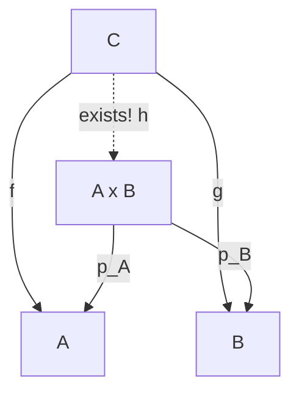

## `structure`: bundling data together

[← Index](00-index.md) | [Next: Structures with type parameters →](02-type-parameters.md)

---

Chapter 1 fixed what a single term and a single function look like, down
to the calculus of constructions itself. But a function of several
arguments, as the chapter introduction just noted, is really a chain of
one-argument functions. `add : Nat → Nat → Nat` never actually receives
two numbers at once. That is fine for arguments that stay independent,
but plenty of the mathematics this book will build, a point in the
plane, later the carrier and operation and axioms of a group together, needs
several pieces of data to travel *together*, as one value, not as
separate arguments a caller has to remember to keep in sync. `structure`
is the answer Lean gives to that need.

A `structure` groups several pieces of data under one name. We will use
this Lean feature constantly once we define groups and rings.

```lean
structure Point where
  x : Nat
  y : Nat

def origin : Point := { x := 0, y := 0 }

#eval origin.x        -- 0
```

Key points.

- `Point.mk` is the automatically generated **constructor**. This is the
  function that actually builds a `Point` out of an `x` and a `y`. `{ x :=
  ..., y := ... }` is shorthand for `Point.mk ... ...`. It names each field
  so the order cannot be mixed up.
- There is an even shorter way to write this. `⟨0, 0⟩` builds the exact
  same `Point`. It simply lists the values in field-declaration order
  instead of naming them. Read `⟨_, _⟩` as **"here are the pieces, in
  order. The constructor is to be inferred from context."** Lean can
  always determine it, because the *expected type* (here, `Point`, from
  `def origin : Point := ...`) indicates exactly which constructor and
  which fields must be filled in. This is also where the official name
  comes from. It is called the **anonymous constructor**, because
  `Point.mk` is never written explicitly. It remains anonymous, and Lean
  infers it from context. `⟨_, _⟩` recurs constantly from Chapter 4
  onward, for proofs as much as for data.
- `p.x` is **field projection** notation, shorthand for `Point.x p`.
  `origin.x` above is exactly this projection applied to `origin`.

```lean
def shift (p : Point) (dx dy : Nat) : Point :=
  { x := p.x + dx, y := p.y + dy }

#eval (shift origin 3 4).y   -- 4
```

`shift` shows a structure used on *both* sides of a function. It takes a
`Point` in (reading its fields back out with the same `p.x`/`p.y`
projection notation) and builds a new one via `{ x := ..., y := ... }`,
the same field-naming syntax used above by `origin`.

Note also that structures can bundle *proofs* alongside data, not just
data. This is exactly how a group will be defined later, a carrier type,
an operation, and proofs that the operation satisfies the group axioms,
all in one `structure`.

**Programmer note (Python).** A Python programmer reaching for the
same "bundle a couple of values together" idea usually writes a `dict`
first.

```python
origin = {"x": 0, "y": 0}
print(origin["z"])   # KeyError: 'z', but only once this line actually runs
```

Nothing about `origin` says which keys it is supposed to have. A typo
in a key name, `origin["ix"]`, is caught the same way a missing key is,
by crashing at run time, on whichever run happens to reach that line
first. `Point.x` has no such failure mode. `origin.z` is rejected while
reading the file, before `#eval` or any test ever runs, because `z` is
not a field `structure Point` declared. A `@dataclass` closes part of
this gap, since `dataclass` at least fixes the field names in advance,
but a plain Python `dataclass` is mutable by default. `origin.x = 99`
silently overwrites the field in place, and any other code still
holding a reference to `origin` sees the change too, whether it wanted
to or not. `shift` above does not do this. It builds a brand new
`Point` and returns it, leaving the `Point` passed in exactly as it
was. Reasoning about `shift p 3 4` never requires asking who else might
be holding onto `p` and whether they will be surprised by it changing
underneath them, a question that has to be asked constantly about
shared mutable Python objects.

**Mathematical reading.** `structure Point where x : Nat; y : Nat` is the
Cartesian product $\mathrm{Point} = \mathbb{N} \times \mathbb{N}$, with `x`
and `y` playing the role of the two projections
$\pi_1, \pi_2 : \mathrm{Point} \to \mathbb{N}$. Here `p.x` computes
$\pi_1(p)$, `p.y` computes $\pi_2(p)$, and `{ x := ..., y := ... }` builds
an element via the universal property of the product (a pair of maps into
the factors determines a unique map into the product). More generally, a
`structure` with fields of types $A_1, \ldots, A_n$ is the $n$-fold product
$A_1 \times \cdots \times A_n$. Once fields are allowed to be *proofs*
(propositions), the same construction becomes a **subset cut out by
conditions**. A structure `{ data : D, proof : P data }` is the dependent
pair (subset) $\{\, d \in D \mid P(d) \,\}$, categorically a subobject of
$D$.

Here is the universal property itself, in the notation of this box. The
unique $h$ making both triangles commute is exactly what `{ x := ..., y :=
... }` constructs when $f$ and $g$ are the two argument expressions of $p$.



### Sources, quoted

Formal definitions and citations for this section, gathered here for
reference (full entries in the [Bibliography](../bibliography.md)):

- **Record / tuple.** "The simplest of these is pairs, or more
  generally tuples, of values ... the generalization from n-ary
  tuples to labeled records is equally straightforward" ([Pierce2002],
  §11.6–§11.8). Picture it like this. An unlabeled tuple is a box
  packed in a fixed order. You just have to remember "first slot is
  the name, second is the age." A labeled record is the same box with
  every slot tagged directly, "Name: ___, Age: ___." The `structure`
  construct in Lean is exactly this tagged version.
- **Categorical product (universal property).** For a category with a
  product $A \times B$ (with projections $p_A, p_B$) and any object
  $C$ with morphisms $f : C \to A$, $g : C \to B$: "there is exactly
  one morphism $h : C \to A \times B$ such that $f = p_A h$ and
  $g = p_B h$" ([Pareigis1970], §1.11, p. 30).
- The Lean 4 documentation ([LeanDocs]) covers the constructor/projection/anonymous-constructor mechanics described above.

[LeanDocs]: ../bibliography.md#leandocs
[Pierce2002]: ../bibliography.md#pierce2002
[Pareigis1970]: ../bibliography.md#pareigis1970

---

[← Index](00-index.md) | [Next: Structures with type parameters →](02-type-parameters.md)
