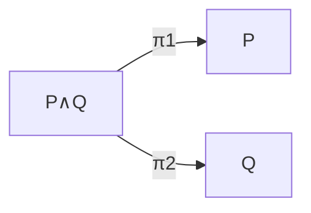
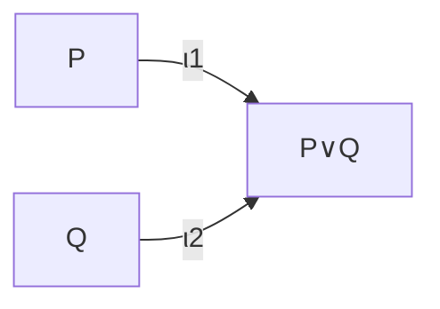

## And, Or, Not

[← Implication](04-implication.md) | [Index](00-index.md) | [Next: Quantifiers →](06-quantifiers.md)

---

<a href="https://live.lean-lang.org/#code=--%20And%0Atheorem%20and_example%20%7BP%20Q%20%3A%20Prop%7D%20%28hp%20%3A%20P%29%20%28hq%20%3A%20Q%29%20%3A%20P%20%E2%88%A7%20Q%20%3A%3D%0A%20%20%E2%9F%A8hp%2C%20hq%E2%9F%A9%0A%0Atheorem%20and_left%20%7BP%20Q%20%3A%20Prop%7D%20%28h%20%3A%20P%20%E2%88%A7%20Q%29%20%3A%20P%20%3A%3D%0A%20%20h.left%0A%0A--%20And%20is%20commutative%2C%20in%20term%20mode%20%28no%20tactics%29%0Atheorem%20and_comm_term%20%7BP%20Q%20%3A%20Prop%7D%20%28h%20%3A%20P%20%E2%88%A7%20Q%29%20%3A%20Q%20%E2%88%A7%20P%20%3A%3D%0A%20%20%E2%9F%A8h.right%2C%20h.left%E2%9F%A9" target="_blank" rel="noopener">&#8599; Open in Lean playground (new tab)</a>

<iframe src="https://live.lean-lang.org/#code=--%20And%0Atheorem%20and_example%20%7BP%20Q%20%3A%20Prop%7D%20%28hp%20%3A%20P%29%20%28hq%20%3A%20Q%29%20%3A%20P%20%E2%88%A7%20Q%20%3A%3D%0A%20%20%E2%9F%A8hp%2C%20hq%E2%9F%A9%0A%0Atheorem%20and_left%20%7BP%20Q%20%3A%20Prop%7D%20%28h%20%3A%20P%20%E2%88%A7%20Q%29%20%3A%20P%20%3A%3D%0A%20%20h.left%0A%0A--%20And%20is%20commutative%2C%20in%20term%20mode%20%28no%20tactics%29%0Atheorem%20and_comm_term%20%7BP%20Q%20%3A%20Prop%7D%20%28h%20%3A%20P%20%E2%88%A7%20Q%29%20%3A%20Q%20%E2%88%A7%20P%20%3A%3D%0A%20%20%E2%9F%A8h.right%2C%20h.left%E2%9F%A9" title="Lean playground" loading="lazy" style="width:100%;height:250px;border:1px solid #ccc;border-radius:8px;">
</iframe>

- `∧` (And) is a structure with two fields `left` and `right`. `⟨hp, hq⟩`
  is the same "here are the pieces, in order" anonymous-constructor
  shorthand from
  [Chapter 2 §1](../02-functions-and-structures/01-structure-basics.md).
  Since the goal is `P ∧ Q`, Lean infers that
  `⟨hp, hq⟩` must mean "build the `And` from a proof of `P` and a proof of
  `Q`," in that order, with no need to spell out `And.intro hp hq`.

<a href="https://live.lean-lang.org/#code=--%20Or%0Atheorem%20or_example%20%7BP%20Q%20%3A%20Prop%7D%20%28hp%20%3A%20P%29%20%3A%20P%20%E2%88%A8%20Q%20%3A%3D%0A%20%20Or.inl%20hp%0A%0A--%20Or%20is%20commutative%20too%2C%20using%20Or.elim%20to%20case-split%20on%20%2Awhich%2A%20disjunct%0A--%20the%20hypothesis%20actually%20is%2C%20without%20the%20%60cases%60%20tactic%0Atheorem%20or_comm_term%20%7BP%20Q%20%3A%20Prop%7D%20%28h%20%3A%20P%20%E2%88%A8%20Q%29%20%3A%20Q%20%E2%88%A8%20P%20%3A%3D%0A%20%20Or.elim%20h%20%28fun%20hp%20%3D%3E%20Or.inr%20hp%29%20%28fun%20hq%20%3D%3E%20Or.inl%20hq%29" target="_blank" rel="noopener">&#8599; Open in Lean playground (new tab)</a>

<iframe src="https://live.lean-lang.org/#code=--%20Or%0Atheorem%20or_example%20%7BP%20Q%20%3A%20Prop%7D%20%28hp%20%3A%20P%29%20%3A%20P%20%E2%88%A8%20Q%20%3A%3D%0A%20%20Or.inl%20hp%0A%0A--%20Or%20is%20commutative%20too%2C%20using%20Or.elim%20to%20case-split%20on%20%2Awhich%2A%20disjunct%0A--%20the%20hypothesis%20actually%20is%2C%20without%20the%20%60cases%60%20tactic%0Atheorem%20or_comm_term%20%7BP%20Q%20%3A%20Prop%7D%20%28h%20%3A%20P%20%E2%88%A8%20Q%29%20%3A%20Q%20%E2%88%A8%20P%20%3A%3D%0A%20%20Or.elim%20h%20%28fun%20hp%20%3D%3E%20Or.inr%20hp%29%20%28fun%20hq%20%3D%3E%20Or.inl%20hq%29" title="Lean playground" loading="lazy" style="width:100%;height:212px;border:1px solid #ccc;border-radius:8px;">
</iframe>

- `∨` (Or) has two constructors, `Or.inl` and `Or.inr`. A proof of `P ∨ Q`
  is either "a proof of `P`" or "a proof of `Q`".
- `Or.elim {P Q R : Prop} (h : P ∨ Q) (hpr : P → R) (hqr : Q → R) : R` is
  the *eliminator* for `Or` — see
  [Chapter 1 §5](../01-basics/05-pi-sigma-and-coc.md) for what "eliminator"
  means formally (the general pattern `Nat.rec` illustrates for `Nat`).
  Given a proof of `P ∨ Q`, and a way to reach
  the same conclusion `R` from either disjunct separately, one obtains a proof
  of `R`. `or_comm_term` above uses it directly in term mode, with no
  [`cases`](https://lean-lang.org/doc/reference/latest/Tactic-Proofs/Tactic-Reference/) and no tactic block. It supplies `fun hp => Or.inr hp` for the
  "if it was `P`" branch and `fun hq => Or.inl hq` for the "if it was `Q`"
  branch.

<a href="https://live.lean-lang.org/#code=--%20Not%2C%20i.e.%20P%20%E2%86%92%20False%0Atheorem%20not_example%20%3A%20%C2%AC%281%20%3D%202%29%20%3A%3D%20by%0A%20%20decide" target="_blank" rel="noopener">&#8599; Open in Lean playground (new tab)</a>

<iframe src="https://live.lean-lang.org/#code=--%20Not%2C%20i.e.%20P%20%E2%86%92%20False%0Atheorem%20not_example%20%3A%20%C2%AC%281%20%3D%202%29%20%3A%3D%20by%0A%20%20decide" title="Lean playground" loading="lazy" style="width:100%;height:180px;border:1px solid #ccc;border-radius:8px;">
</iframe>

- `¬P` is notation for `P → False`. To prove a negation, assume `P` holds
  and derive `False`.

<a href="https://live.lean-lang.org/#code=--%20Deriving%20False%20from%20a%20genuine%20contradiction%2C%20then%20using%20%60absurd%60%20to%0A--%20close%20any%20goal%20at%20all%20once%20you%20have%20one%0Atheorem%20anything_from_contradiction%20%7BP%20%3A%20Prop%7D%20%28h1%20%3A%201%20%3D%202%29%20%28h2%20%3A%20%281%3ANat%29%20%E2%89%A0%202%29%20%3A%20P%20%3A%3D%0A%20%20absurd%20h1%20h2" target="_blank" rel="noopener">&#8599; Open in Lean playground (new tab)</a>

<iframe src="https://live.lean-lang.org/#code=--%20Deriving%20False%20from%20a%20genuine%20contradiction%2C%20then%20using%20%60absurd%60%20to%0A--%20close%20any%20goal%20at%20all%20once%20you%20have%20one%0Atheorem%20anything_from_contradiction%20%7BP%20%3A%20Prop%7D%20%28h1%20%3A%201%20%3D%202%29%20%28h2%20%3A%20%281%3ANat%29%20%E2%89%A0%202%29%20%3A%20P%20%3A%3D%0A%20%20absurd%20h1%20h2" title="Lean playground" loading="lazy" style="width:100%;height:180px;border:1px solid #ccc;border-radius:8px;">
</iframe>

- `absurd {P Q : Prop} (h1 : P) (h2 : ¬P) : Q` derives *anything at all*
  from a genuine contradiction: a direct proof of `P` together with a
  proof that `P` is impossible. `anything_from_contradiction` shows this
  concretely. From `1 = 2` and `1 ≠ 2` (contradictory hypotheses that could
  never both hold, but which Lean happily accepts as *given*
  hypotheses in a signature — nothing prevents assuming something
  false; it only prevents *proving* it from nothing), one may
  conclude literally any proposition `P` whatsoever. This is the "ex falso
  quodlibet" principle from classical logic, made concrete. Once a
  contradiction is present among the hypotheses, the goal being
  proved stops mattering.

**Mathematical reading.** These are the constructive readings of the
connectives as operations on the proof-sets. Conjunction $P \wedge Q$ is
the **product** $P \times Q$: a proof is a pair $\langle p, q\rangle$, so
`and_example` builds $(p,q)$ and `and_left` applies $\pi_1$:

| Symbol | Lean |
| --- | --- |
| $P \wedge Q$ ("and") | `P ∧ Q` |
| $\langle p, q \rangle$ ("pairing") | `⟨hp, hq⟩` (`and_example`) |
| $\pi_1, \pi_2$ ("the projections") | `h.left`, `h.right` (`and_left` applies `.left`) |

Disjunction $P \vee Q$ is the **coproduct** $P \sqcup Q$, the mirror image:
arrows point *in* rather than *out*, and a proof is a tagged injection.

| Symbol | Lean |
| --- | --- |
| $P \vee Q$ ("or") | `P ∨ Q` |
| $\iota_1(p)$ ("left injection") | `Or.inl hp` (`or_example`) |
| $\iota_2(q)$ ("right injection") | `Or.inr hq` |

To *use* a proof of $P \vee Q$, one case-splits by the universal property of
the coproduct: given a proof `h : P ∨ Q` and a way to reach the same
conclusion `R` from either side (`hpr : P → R`, `hqr : Q → R`), there is
exactly one map `P∨Q → R` agreeing with both. This is precisely what
`or_comm_term` above builds via `Or.elim`. Negation is $\neg P := (P \to
\bot)$, a map into the initial object $\bot = \varnothing$. A proof of
$\neg(1=2)$ is a function turning the (impossible) hypothesis $1 = 2$ into
an element of $\varnothing$, vacuously. Here it is discharged by [`decide`](https://lean-lang.org/doc/reference/latest/Tactic-Proofs/Tactic-Reference/),
which mechanically confirms $1 \neq 2$ since equality of `Nat` literals is
decidable. Underlying this is exactly the same fact used throughout this
book: distinct constructors of an inductive type (`Nat.succ`, applied a
different number of times) are disjoint, so `1 = 2` has no proof to begin
with. Observe that this is *intuitionistic* logic: there is no built-in law of
excluded middle.

---

[← Implication](04-implication.md) | [Index](00-index.md) | [Next: Quantifiers →](06-quantifiers.md)
