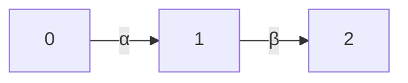

## Defining a quiver in Lean

[← Paths](02-paths.md) | [Index](00-index.md) | [Next: Paths as an inductive type →](04-paths-as-inductive-type.md)

---

A quiver is encoded as a `structure`, parameterized by a type of vertices and
a type of arrows:

```lean
structure Quiver (V : Type) (A : Type) where
  source : A → V
  target : A → V
```

This is a direct transcription: `V` is the type of vertices, `A` the type of
arrows, and `source`/`target` are exactly $s$ and $t$ above.

**Mathematical reading.** `Quiver V A` is a quiver $Q = (V, A, s, t)$: the
data of two functions $s, t : A \to V$, i.e. a parallel pair of arrows
$A \rightrightarrows V$ in $\mathbf{Set}$. A quiver is precisely
the underlying data of a small category *before* composition and
identities are imposed: the raw generators from which the free category (paths)
is built.

### The example quiver, formalized

The three vertices are encoded as `Fin 3` (values `0, 1, 2`, standing for
vertices `1, 2, 3`) and the two nontrivial arrows as an inductive type:

```lean
inductive ExampleArrow where
  | alpha : ExampleArrow   -- 0 → 1
  | beta : ExampleArrow     -- 1 → 2

def exampleQuiver : Quiver (Fin 3) ExampleArrow where
  source := fun a => match a with
    | ExampleArrow.alpha => 0
    | ExampleArrow.beta => 1
  target := fun a => match a with
    | ExampleArrow.alpha => 1
    | ExampleArrow.beta => 2
```

`inductive ExampleArrow where | alpha : ExampleArrow | beta : ExampleArrow`
defines a brand-new type with exactly two values, `alpha` and `beta`. This
is the same `inductive` mechanism that builds `Nat` (Chapter 1) and `Bool`,
just with two constructors that carry no extra data.

**Mathematical reading.** This is the concrete quiver $Q$ with vertex set
$V = \{0,1,2\}$ (encoded as $\mathrm{Fin}\,3$) and arrow set $A =
\{\alpha, \beta\}$, where $s(\alpha)=0,\ t(\alpha)=1$ and $s(\beta)=1,\
t(\beta)=2$: the linear $A_3$ quiver, drawn exactly as on paper:



| Symbol | Lean |
| --- | --- |
| $0, 1, 2 \in V$ ("vertices") | `(0 : Fin 3)`, `(1 : Fin 3)`, `(2 : Fin 3)` |
| $\alpha, \beta \in A$ ("arrows") | `ExampleArrow.alpha`, `ExampleArrow.beta` |
| $s, t : A \to V$ ("source, target") | `exampleQuiver.source`, `exampleQuiver.target` |

The two-element inductive type is the finite set $A = \{\alpha,\beta\}$,
and the `match`-defined `source`/`target` are the functions $s, t : A \to
V$ given by their value tables: `source alpha = 0`, `target alpha = 1`,
`source beta = 1`, `target beta = 2`. This is exactly the arrowheads and
tails drawn above.

**Mathlib equivalent.** Mathlib's own [`Quiver`](https://loogle.lean-lang.org/?q=Quiver) class (the one this
chapter's opening section mentioned building from scratch instead of
reusing) encodes arrows differently. Instead of one flat arrow type `A`
plus separate `source`/`target : A → V` functions, it bakes the endpoints
into the arrow's *type* directly, `Hom : V → V → Sort*` (with notation
`a ⟶ b`). Thus an arrow from `i` to `j` simply *has type* `i ⟶ j`:

```lean
inductive MyArrow : Fin 3 → Fin 3 → Type
  | alpha : MyArrow 0 1
  | beta : MyArrow 1 2

instance : Quiver (Fin 3) := ⟨MyArrow⟩
```

`MyArrow 0 1` has exactly the one constructor `alpha`. `MyArrow i j` for
any other pair `(i, j)`, in particular the "backwards" or "no such arrow"
cases, has no constructors at all, and is thus simply an empty type. There is
no `source`/`target` to state or prove separately, and no `h : Q.source a = v`
side-condition to discharge with `rfl` later (Chapter 11 §4). An
ill-typed composition is rejected by the type checker before a proof
obligation is even reached, one step earlier than the book's own encoding
catches the same mistake.

---

[← Paths](02-paths.md) | [Index](00-index.md) | [Next: Paths as an inductive type →](04-paths-as-inductive-type.md)
