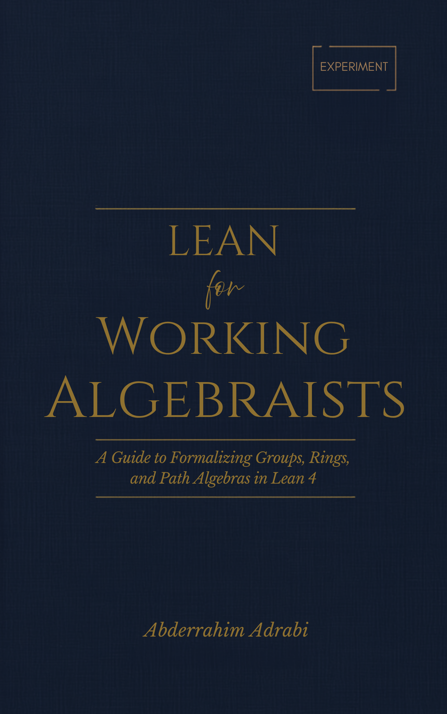

# lean4-learning

## [📖 Read the book (PDF)](https://github.com/abderrahim-lectures/lean4-learning/releases/latest/download/lean-for-working-algebraists.pdf)

[View in browser (no download)](https://docs.google.com/viewer?url=https%3A%2F%2Fgithub.com%2Fabderrahim-lectures%2Flean4-learning%2Freleases%2Flatest%2Fdownload%2Flean-for-working-algebraists.pdf&embedded=true) | [Notice](NOTICE.md) | [Reproducing this book](REPRODUCING.md)

The book is a single PDF — the link above downloads the latest version
directly, no account or software installation required; use "View in
browser" instead to read it without downloading anything. The rest of
this page describes the book and its companion material for readers who
also want to run the Lean code or the Python examples on their own
machine or in a browser.

## Summary

This repository contains **Lean for Working Algebraists**, an introduction
to the Lean 4 proof assistant for readers with a background in abstract
algebra and basic category theory (objects, morphisms, composition,
functors), and no prior exposure to Lean, formal logic, or programming.
The book develops Lean 4 syntax and tactics from first principles, then
uses them to formalize groups, rings, modules, and quiver path algebras,
building every definition from scratch rather than relying on Mathlib.
Starting in Chapter 6, each worked example is followed by a "Mathlib
equivalent" showing the same construction phrased against Mathlib's real
API, so the from-scratch material and the library a reader will use
afterward are both covered.

**Learning objectives.** By the end of this book, read and write basic
Lean 4 terms, types, and function definitions, including implicit
arguments and dependent types; construct and interpret proofs using
Lean's tactic language, and diagnose a failing tactic from the goal
state; state and prove properties of groups, rings, and modules as Lean
structures built from first principles; represent a quiver as a Lean
structure and construct its path algebra; search Lean's tactic and lemma
library efficiently, and choose between term-mode and tactic-mode proofs;
and translate a from-scratch algebraic construction into its Mathlib
equivalent.

## Pedagogical approach

The book uses several recurring devices, applied consistently across all
14 chapters:

- **Learning objectives and key points.** Each chapter opens with a
  learning-objectives statement and closes with a key-points recap before
  its exercises.
- **Mathematical reading.** Most Lean code blocks are followed by a
  "Mathematical reading" box translating the code into the standard
  notation a working algebraist would recognize from a textbook,
  including the categorical reading (functors, universal properties,
  Hom-sets) where it clarifies what the code encodes.
- **Programmer's corner (Python).** At several points, an optional box
  compares a Lean construct to its nearest Python analogue, for readers
  with programming background but no prior exposure to formal logic or
  type theory.
- **Mathlib equivalent.** Starting in Chapter 6, each worked example is
  followed by a box showing the same statement phrased against Mathlib's
  real API, so the from-scratch construction and the library a reader
  will use afterward are both covered.
- **Socratic questions.** Each chapter includes reflective "why X, not
  Y?" questions with their answers, distinct from the recap and the
  exercises.
- **Checkpoint projects.** Two projects, placed after Chapter 5 and
  after Chapter 11, apply material from all preceding chapters to a
  single self-contained construction, each with a self-verification step
  and a full solution in the appendix.
- **Exercises with full solutions.** Every chapter's exercises have a
  complete worked solution in the [appendix](lean_book/14-appendix-solutions/00-index.md),
  and every Lean snippet in the book (main text and solutions) is
  verified against the pinned toolchain, not merely written and assumed
  correct.

## Contents

- [lean_book/](lean_book/) — the book itself. See
  [lean_book/README.md](lean_book/README.md) for the full table of
  contents.
- [lean_project/](lean_project/) — a companion Lean 4 project (toolchain
  `v4.31.0`) containing every code block from the book, ported into one
  module per chapter and verified to compile with `lake build` (see
  [lean_project/README.md](lean_project/README.md) for setup). This
  caught and fixed several real bugs in the book's original code — see
  the git history for specifics. Opens directly in a
  [GitHub Codespace](https://codespaces.new/abderrahim-lectures/lean4-learning),
  toolchain and dependencies installed automatically.
- [lean_book/python-companion/](lean_book/python-companion/) — every
  "Programmer's corner (Python)" snippet in the book, collected into one
  notebook that opens directly in
  [Google Colab](https://colab.research.google.com/github/abderrahim-lectures/lean4-learning/blob/master/lean_book/python-companion/python_companion.ipynb),
  no installation required.

## Contributing

Found a mistake in the book, or want to propose a change? See
[CONTRIBUTING.md](CONTRIBUTING.md) for how to report it or open a pull
request.

## Project history

Every change to this repository — bug fix, new feature, or content
revision — is tracked as its own GitHub issue, closed by the pull request
that addresses it. See [PROJECT-HISTORY.md](PROJECT-HISTORY.md) for a
summary of all issues and pull requests to date, and
[lean_book/CHANGELOG.md](lean_book/CHANGELOG.md) for the reader-facing
summary of what changed in each release.
