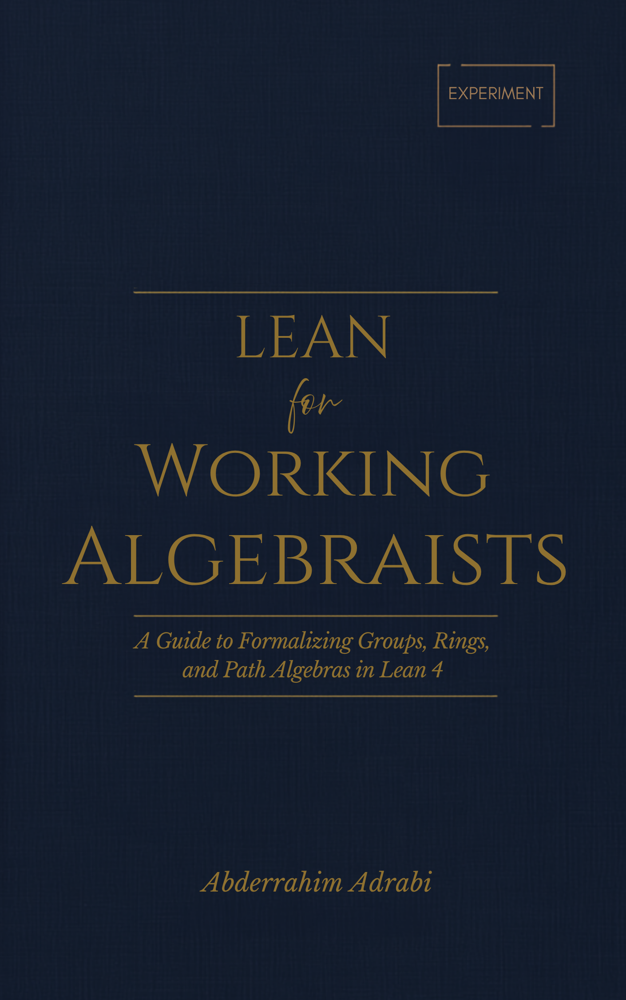

# Lean for Working Algebraists

## [📖 Read the book (in your browser)](https://docs.google.com/viewer?url=https%3A%2F%2Fgithub.com%2Fabderrahim-lectures%2Flean4-learning%2Freleases%2Flatest%2Fdownload%2Flean-for-working-algebraists.pdf&embedded=true)

[-green?logo=github)](https://abderrahim-lectures.github.io/lean4-learning/)

[Notice](NOTICE.md) | [Reproducing this book](REPRODUCING.md)

The book is a single PDF. The link above opens it directly in your
browser via the viewer of Google. No account or software installation is
required. Use the "Download PDF" badge instead to save a copy, or
"Browse online" to read it as a normal linked website (one page per
section) instead of a PDF. "Try Lean now" opens the official Lean 4 web
playground, embedded and ready to use. No toolchain install is needed to
experiment. The rest of this page describes the book and its companion
material for readers who also want to run the Lean code or the Python
examples on their own machine or in a browser.

Every release also attaches a version-named copy of the PDF (for example
`lean-for-working-algebraists-v2.0.5.pdf`) alongside the plain
`lean-for-working-algebraists.pdf`, so a saved download can be traced
back to the exact release it came from. See the
[releases page](https://github.com/abderrahim-lectures/lean4-learning/releases)
for every version.

## Summary

This repository contains **Lean for Working Algebraists**, an introduction
to the Lean 4 proof assistant for readers with a background in abstract
algebra and basic category theory (objects, morphisms, composition,
functors), and no prior exposure to Lean, formal logic, or programming.
The book develops Lean 4 syntax and tactics from first principles, then
uses them to formalize groups, rings, modules, and quiver path algebras,
building every definition from scratch rather than relying on Mathlib.
Starting in Chapter 7, each worked example is followed by a "Mathlib
equivalent" showing the same construction phrased against the real
API of Mathlib, so the from-scratch material and the library a reader will use
afterward are both covered. By the end, you can read and write basic Lean
4 terms, types, and function definitions (implicit arguments, dependent
types), construct and interpret tactic-mode proofs and diagnose a failing
tactic from the goal state, state and prove properties of groups, rings,
and modules as Lean structures, represent a quiver as a Lean structure
and build its path algebra, search the tactic and lemma library of Lean
efficiently, choose between term-mode and tactic-mode proofs, and
translate a from-scratch algebraic construction into its Mathlib
equivalent.

## Pedagogical approach

This book teaches by derivation, not by dispensation, in the tradition
of Arnold's and Gelfand's teaching rather than Bourbaki's. "It is
impossible to understand an unmotivated definition" (Arnold, *On
Teaching Mathematics*, 1997): every definition and theorem in this book
is *earned*. A section poses the question or concrete problem that forces
a concept, walks the reasoning that discovers it, and only then names
and formalizes the result, mirroring Gelfand's Moscow seminar method of
finding the simplest example that captures a phenomenon before finding
the language to state it generally. There is no fixed
Definition→Theorem→Proof→Remark skeleton imposed on that reasoning;
structure follows the logic of the argument, not a template. Formulas
and theorems are proved before they are used, never handed down as rules
to memorize. Exercises favor fewer, harder, escalating, proof-heavy
problems over repetitive drills, and do not give away their own answer;
solutions live in [15-appendix-solutions/](lean_book/15-appendix-solutions/00-index.md).
See [CONTRIBUTING.md](CONTRIBUTING.md#book-prose-conventions) for the
convention as a checklist, and
[Chapter 7](lean_book/07-groups/00-index.md) for it applied in full.

The book uses several recurring devices, applied consistently across all
15 chapters (Chapters 0–14):

- **Chapter openers.** Each chapter's `00-index.md` opens with the
  derivation-first prose described above and a "Learning objectives"
  box naming the concrete goals of that chapter, and closes with a
  key-points recap before its exercises.
- **Mathematical reading.** Most Lean code blocks are followed by a
  "Mathematical reading" box translating the code into the standard
  notation a working algebraist would recognize from a textbook,
  including the categorical reading (functors, universal properties,
  Hom-sets) where it clarifies what the code encodes.
- **Programmer note (Python).** Nearly every chapter includes an
  optional box grounding the value of Lean and functional programming
  in a concrete Python failure mode (an untyped `dict` `KeyError`, a
  runtime `assert`, a `float` silently breaking associativity, and the
  like), for readers with programming background but no prior exposure
  to formal logic or type theory.
- **Mathlib equivalent.** Starting in Chapter 7, each worked example is
  followed by a box showing the same statement phrased against the
  real API of Mathlib, so the from-scratch construction and the library a reader
  will use afterward are both covered.
- **Step-by-step tracing.** Every genuinely recursive Lean definition in
  the book (`Vec.replicate`, `Path.append`, and the rest) has a
  `dbg_trace`-annotated sibling showing the recursion unwind one call at
  a time, verified against the real toolchain. Non-recursive code
  (`structure`/`instance` declarations, single-step pattern matches,
  tactic-mode proofs) has no such trace, since there is no multi-step
  computation to show.
- **Sources, quoted.** Every formally cited term closes its section with
  a verbatim quote and a precise citation, tied directly into the
  derivation rather than glossed through a separate analogy.
- **Checkpoint projects.** Two projects, placed after Chapter 6 and
  after Chapter 12, apply material from all preceding chapters to a
  single self-contained construction, each with a self-verification step
  and a full solution in the appendix.
- **Exercises with full solutions.** The exercises of every chapter have a
  complete worked solution in the [appendix](lean_book/15-appendix-solutions/00-index.md),
  and every Lean snippet in the book (main text and solutions) is
  verified against the pinned toolchain, not merely written and assumed
  correct.

## Contents

- [lean_book/](lean_book/), the book itself. See
  [lean_book/README.md](lean_book/README.md) for the full table of
  contents.
- [lean_project/](lean_project/), a companion Lean 4 project (toolchain
  `v4.33.1`) containing every code block from the book, ported into one
  module per chapter and verified to compile with `lake build` (see
  [lean_project/README.md](lean_project/README.md) for setup). This
  caught and fixed several real bugs in the original code of the book;
  see the git history for specifics. Opens directly in a
  [GitHub Codespace](https://codespaces.new/abderrahim-lectures/lean4-learning),
  toolchain and dependencies installed automatically.
- [lean_book/python-companion/](lean_book/python-companion/), every
  "Programmer note (Python)" snippet in the book, collected into one
  notebook that opens directly in
  [Google Colab](https://colab.research.google.com/github/abderrahim-lectures/lean4-learning/blob/master/lean_book/python-companion/python_companion.ipynb)
  or [Binder](https://mybinder.org/v2/gh/abderrahim-lectures/lean4-learning/master?filepath=lean_book%2Fpython-companion%2Fpython_companion.ipynb),
  no installation required.

## Contributing

Found a mistake in the book, or want to propose a change? See
[CONTRIBUTING.md](CONTRIBUTING.md) for how to report it or open a pull
request.

## Project history

Every change to this repository, whether bug fix, new feature, or content
revision, is tracked as its own GitHub issue, closed by the pull request
that addresses it. See [PROJECT-HISTORY.md](PROJECT-HISTORY.md) for a
summary of all issues and pull requests to date, and
[lean_book/changelog/](lean_book/changelog/README.md) for the
reader-facing summary of what changed in each release.
