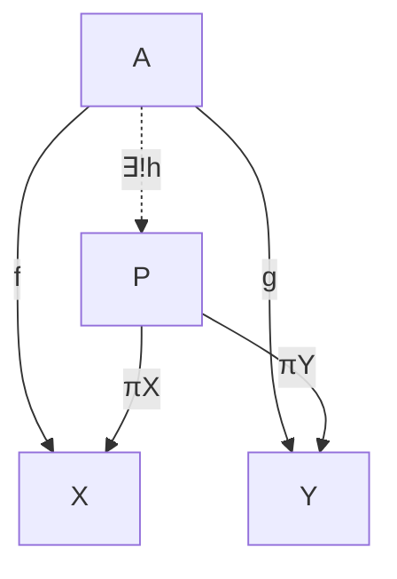
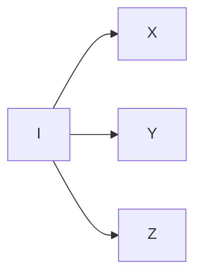
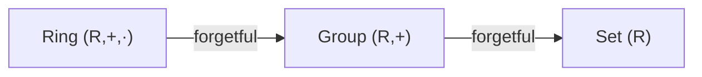
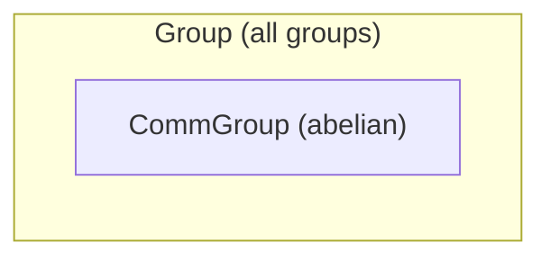

## Terminology you'll meet before it's fully explained

[← Dependent types, categorically](03-dependent-types.md) | [Index](00-index.md)

---

Four words are going to recur constantly from here on, well before this
book gives any of them a full formal treatment (that treatment lives in
[Appendix B](../15-lambda-calculus/00-index.md), which most readers will
want to save for after finishing the main chapters). Rather than leave
them undefined until the very end, here is a working definition of each,
good enough to use immediately, with a pointer to where the precise
version lives.

**Elaborate / elaboration.** The process by which Lean turns the surface
syntax you type into a fully-explicit, fully-typed internal term: filling
in implicit arguments, resolving notation, checking every subterm's type
against what's expected. When this book says an expression "elaborates
to" something, it means "after Lean has finished this filling-in process,
what you actually get is..." — e.g. `identity 5` *elaborates to*
`@identity Nat 5` (Chapter 1), with `α := Nat` filled in silently.
Elaboration is not guessing; it's a deterministic algorithm driven by the
typing rules of Lean's underlying calculus.

> Read more: [Appendix B §5](../15-lambda-calculus/05-lambda-to-lean.md)
> describes elaboration precisely as type inference for the calculus of
> constructions.

**Unify / unification.** The specific step inside elaboration that solves
"what must this placeholder be, given what I already know?" When Lean
sees `identity 5` and knows `identity : {α : Type} → α → α`, it *unifies*
the type of `5` (namely `Nat`) with the placeholder `α`, concluding
`α := Nat`. Unification is what makes implicit-argument inference
(Chapter 1), `apply`'s subgoal-matching (Chapter 4), and typeclass
instance search (Chapter 5) all work — in each case, Lean is solving an
equation between two (possibly partially unknown) terms.

> Read more: [Appendix B §5](../15-lambda-calculus/05-lambda-to-lean.md).

**Reduce / reduction, normal form.** A term **reduces** by repeatedly
applying its computation rules — substituting an abstraction's argument
into its body (β-reduction), unfolding a `def`, or simplifying a `match`
on a known constructor. A term with no more reductions available is in
**normal form**. `#eval` (Chapter 1) computes a term's normal form and
prints it; `rfl` (Chapter 3) succeeds exactly when both sides of an
equation share a normal form. In practice, Lean's kernel usually only
reduces as far as it needs to progress — down to **weak head normal
form** (far enough to see the outermost constructor or function head),
not necessarily all the way down — which is why, e.g., `Nat.add`'s
recursion on its *second* argument (Chapter 4) determines which side of
an equation reduces "for free" and which needs an explicit inductive
argument: Lean only unfolds `a + b` far enough to expose `b`'s shape, so
`a + 0` reduces immediately (the second argument is already the base
case) while `0 + a`, with an unknown `a` in the position `Nat.add`
recurses on, does not reduce at all until `a` itself is known.

> Read more: [Appendix B §1](../15-lambda-calculus/01-untyped-lambda-calculus.md)
> defines β-reduction and normal forms precisely, in the untyped setting
> where the idea is easiest to see in isolation.

**Motive.** The (possibly type-dependent) predicate or type family that a
tactic like `induction` or `rw` is secretly generalizing your goal over
before it operates. When `rw [h]` fails with **"motive is not type
correct,"** it means: to replace one side of `h` with the other
throughout your goal, Lean first abstracts your goal into a function `C`
(the motive) taking the rewritten term as a parameter — and here, that
abstraction produces an ill-typed `C`, typically because the term you're
rewriting appears inside a dependent type's *index* (as in Chapter 11's
`Path`, whose very type depends on specific vertices) rather than in a
position that can vary freely. The fix is almost always to restate the
goal first with `show`, or to generalize the index explicitly, so the
motive Lean builds is well-typed.

> Read more: [Chapter 5 §3](../05-rigor-check/03-defeq-vs-propeq.md)
> revisits "motive is not type correct" alongside definitional equality;
> [Appendix B §4](../15-lambda-calculus/04-dependent-types-coc.md) shows
> the recursor/eliminator (e.g. `Nat.rec`) whose own type is literally
> parameterized by a motive, which is where the name comes from.

### Category-theory terms used beyond the baseline

The README promised that the only category theory assumed going in is
"objects, morphisms, composition, functors." That's true of the main text,
but the optional "Mathematical reading" boxes scattered through later
chapters occasionally reach one notch further, for readers who already
have a bit more category theory and would enjoy the extra precision. Four
such terms recur often enough to be worth fixing once here, so that every
later use can simply point back to this entry instead of re-explaining (or
worse, silently assuming) each time:

**Universal property.** A characterization of a construction not by what
it's *made of*, but by what maps *uniquely factor through it* — "$X$ has
property $U$" meaning "for every $Y$ with the relevant data, there is
exactly one map $Y \to X$ compatible with that data." This is the
category-theorist's way of saying "$X$ is the *best possible* solution to
a mapping problem," and it's the same idea as the familiar universal
properties of products, quotients, and free constructions from an algebra
course — nothing new is meant by the phrase here beyond that. The classic
picture, for a product $X \times Y$: given any $A$ with maps to both
factors, there's exactly one map into the product making everything agree
(the dashed arrow):

| Symbol | Lean |
| --- | --- |
| $A$, $X$, $Y$, $P$ ("the objects") | types `A`, `X`, `Y`, `X × Y` |
| $f$, $g$ ("the given maps") | ordinary functions `f : A → X`, `g : A → Y` |
| $\exists!$ ("there exists a unique") | — no single token; witnessed by supplying `h` and proving it's the only one |
| $h$ ("the mediating map") | `fun a => (f a, g a) : A → X × Y` |
| $\pi_X, \pi_Y$ ("the projections") | `Prod.fst`, `Prod.snd` (`.1`/`.2`, or `.fst`/`.snd`) |

Read the diagram as: you're *given* the two solid outer arrows ($f$ and
$g$); the universal property *asserts* the dashed middle arrow $h$ exists,
is unique, and makes both triangles commute — $\pi_X \circ h = f$ and
$\pi_Y \circ h = g$, i.e. `h a |>.1 = f a` and `h a |>.2 = g a` for every
`a`. "Commute" just means: any two paths between the same two objects in
the diagram compose to the same map. This is exactly what `⟨_, _⟩` does
for `Pair`/`structure` types (Chapter 2 §1): give it an `f`-shaped piece
and a `g`-shaped piece, and it hands back the unique `h` combining them.

**Initial object.** An object $I$ of a category with a *unique* morphism
$I \to X$ out to every other object $X$ — the universal property above,
specialized to "the best possible source":

| Symbol | Lean |
| --- | --- |
| $I$ ("the initial object") | `Nat` (in `Type`) or `ℤ` (in `Ring`) |
| $I \to X$ ("the unique arrow") | for `Nat`: `Nat.rec` — build a value of *any* `X` by giving a `zero` case and a `succ` case, and that recipe is forced by `Nat`'s two constructors, with no other choice possible |

Exactly one arrow leaves $I$ for every object in the category — never
zero (there's always a map), never more than one (no choice about which).
`Nat` ([Chapter 1 §1](01-everything-has-a-type.md)) and
`ℤ` in `Ring` (Chapter 8) are both flagged as initial objects of the
relevant category in this sense: any structure-preserving map out of them
is forced, with no choice involved.

**Forgetful functor.** A functor that takes a structure and *keeps only
part of it*, discarding the rest — e.g. the map sending a group $G$ to its
underlying set (forgetting the multiplication), or a `Ring` to its
underlying `Group` under addition (forgetting multiplication and its
unit):

| Symbol | Lean |
| --- | --- |
| `Ring` $\to$ `Group` ("forgets $\cdot$") | `r.toGroup` (or `r.toAddGroup`, depending on naming) for `r : Ring R` |
| `Group` $\to$ `Set` ("forgets $+$") | `g.carrier`, or simply treating `G : Type` as its own underlying set |

Each arrow keeps *less* structure than the one before it — a `Ring`
remembers both operations, the `Group` it maps to remembers only
addition, the `Set` it maps to remembers only the underlying elements. In
this book, every `.toGroup`/`.toAddGroup`-style field generated by Lean's
`extends`
([Chapter 2 §3](../02-functions-and-structures/03-extending-structures.md)
onward) *is* a forgetful functor,
computationally: it's the projection that keeps some of a structure's
data and drops the rest.

**Subobject / full subcategory.** A subobject of $X$ is (informally) "a
subset of $X$ cut out by some condition, remembered together with its
inclusion into $X$" — e.g. `CommGroup` is a subobject of `Group`'s data,
cut out by the extra commutativity axiom:

| Symbol | Lean |
| --- | --- |
| $\subseteq$ ("subobject inclusion") | `structure CommGroup (G) extends Group G where comm : ...` |
| $\iota$ ("the inclusion map") | `.toGroup`, the field `extends` generates automatically |

A full subcategory is the category formed by all objects satisfying such
a condition, together with *all* morphisms between them inherited
unchanged from the ambient category (nothing is removed at the morphism
level, only at the object level) — e.g. abelian groups form a full
subcategory of all groups.

These four are the ones worth fixing once; if a "Mathematical reading" box
elsewhere uses a still-more-specialized term (adjunction, biproduct, a
presheaf category, and the like), treat it as genuinely optional bonus
content for readers who already know it — nothing later in the book
depends on it, and the surrounding plain-English explanation always stands
on its own without it.

---

[← Dependent types, categorically](03-dependent-types.md) | [Index](00-index.md) | [Table of contents](../README.md) | [Ch. 2: Functions & Structures →](../02-functions-and-structures/00-index.md)
