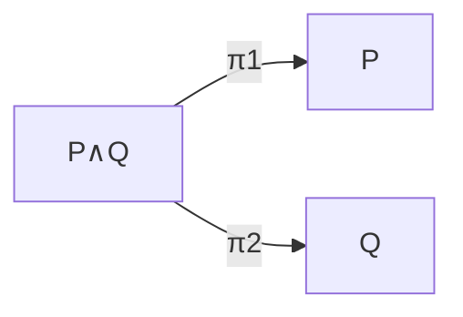
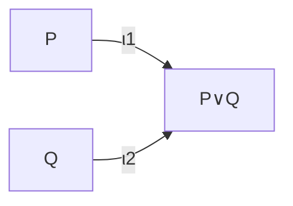

## And, Or, Not

[← Implication](03-implication.md) | [Index](00-index.md) | [Next: Quantifiers →](05-quantifiers.md)

---

```lean
-- And
theorem and_example {P Q : Prop} (hp : P) (hq : Q) : P ∧ Q :=
  ⟨hp, hq⟩

theorem and_left {P Q : Prop} (h : P ∧ Q) : P :=
  h.left

-- And is commutative, in term mode (no tactics)
theorem and_comm_term {P Q : Prop} (h : P ∧ Q) : Q ∧ P :=
  ⟨h.right, h.left⟩
```

- `∧` (And) is a structure with two fields `left` and `right`. `⟨hp, hq⟩`
  is the same "here are the pieces, in order" anonymous-constructor
  shorthand from
  [Chapter 2 §1](../02-functions-and-structures/01-structure-basics.md).
  Lean sees the goal is `P ∧ Q`, so it knows
  `⟨hp, hq⟩` must mean "build the `And` from a proof of `P` and a proof of
  `Q`," in that order, with no need to spell out `And.intro hp hq`.

```lean
-- Or
theorem or_example {P Q : Prop} (hp : P) : P ∨ Q :=
  Or.inl hp

-- Or is commutative too, using Or.elim to case-split on *which* disjunct
-- the hypothesis actually is, without the `cases` tactic
theorem or_comm_term {P Q : Prop} (h : P ∨ Q) : Q ∨ P :=
  Or.elim h (fun hp => Or.inr hp) (fun hq => Or.inl hq)
```

- `∨` (Or) has two constructors, `Or.inl` and `Or.inr`. A proof of `P ∨ Q`
  is either "here's a proof of `P`" or "here's a proof of `Q`".
- `Or.elim {P Q R : Prop} (h : P ∨ Q) (hpr : P → R) (hqr : Q → R) : R` is
  the *eliminator* for `Or`. Given a proof of `P ∨ Q`, and a way to reach
  the same conclusion `R` from either disjunct separately, you get a proof
  of `R`. `or_comm_term` above uses it directly in term mode, with no
  `cases` and no tactic block. It supplies `fun hp => Or.inr hp` for the
  "if it was `P`" branch and `fun hq => Or.inl hq` for the "if it was `Q`"
  branch.

```lean
-- Not, i.e. P → False
theorem not_example : ¬(1 = 2) := by
  decide
```

- `¬P` is notation for `P → False`. To prove a negation, assume `P` holds
  and derive `False`.

```lean
-- Deriving False from a genuine contradiction, then using `absurd` to
-- close any goal at all once you have one
theorem anything_from_contradiction {P : Prop} (h1 : 1 = 2) (h2 : (1:Nat) ≠ 2) : P :=
  absurd h1 h2
```

- `absurd {P Q : Prop} (h1 : P) (h2 : ¬P) : Q` derives *anything at all*
  from a genuine contradiction: a direct proof of `P` together with a
  proof that `P` is impossible. `anything_from_contradiction` shows this
  concretely. From `1 = 2` and `1 ≠ 2` (contradictory hypotheses that could
  never both hold, but which Lean will happily accept as *given*
  hypotheses in a signature — nothing stops you from assuming something
  false, it only stops you from *proving* it from nothing), you can
  conclude literally any proposition `P` whatsoever. This is the "ex falso
  quodlibet" principle from classical logic, made concrete. Once you have
  a contradiction in your hypotheses, the goal you're trying to prove
  stops mattering.

**Mathematical reading.** These are the constructive readings of the
connectives as operations on the proof-sets. Conjunction $P \wedge Q$ is
the **product** $P \times Q$: a proof is a pair $\langle p, q\rangle$, so
`and_example` builds $(p,q)$ and `and_left` applies $\pi_1$:



| Symbol | Lean |
| --- | --- |
| $P \wedge Q$ ("and") | `P ∧ Q` |
| $\langle p, q \rangle$ ("pairing") | `⟨hp, hq⟩` (`and_example`) |
| $\pi_1, \pi_2$ ("the projections") | `h.left`, `h.right` (`and_left` applies `.left`) |

Disjunction $P \vee Q$ is the **coproduct** $P \sqcup Q$, the mirror image.
Arrows point *in* rather than *out*, and a proof is a tagged injection:



| Symbol | Lean |
| --- | --- |
| $P \vee Q$ ("or") | `P ∨ Q` |
| $\iota_1(p)$ ("left injection") | `Or.inl hp` (`or_example`) |
| $\iota_2(q)$ ("right injection") | `Or.inr hq` |

To *use* a proof of $P \vee Q$, you case-split by the universal property of
the coproduct: given a proof `h : P ∨ Q` and a way to reach the same
conclusion `R` from either side (`hpr : P → R`, `hqr : Q → R`), there's
exactly one map `P∨Q → R` agreeing with both. This is precisely what
`or_comm_term` above builds via `Or.elim`. Negation is $\neg P := (P \to
\bot)$, a map into the initial object $\bot = \varnothing$. A proof of
$\neg(1=2)$ is a function turning the (impossible) hypothesis $1 = 2$ into
an element of $\varnothing$, vacuously. Here it is discharged by `decide`,
which mechanically confirms $1 \neq 2$ since equality of `Nat` literals is
decidable. But underneath is exactly the same fact used throughout this
book: distinct constructors of an inductive type (`Nat.succ`, applied a
different number of times) are disjoint, so `1 = 2` has no proof to begin
with. Note that this is *intuitionistic* logic: there is no built-in law of
excluded middle.

---

[← Implication](03-implication.md) | [Index](00-index.md) | [Next: Quantifiers →](05-quantifiers.md)
