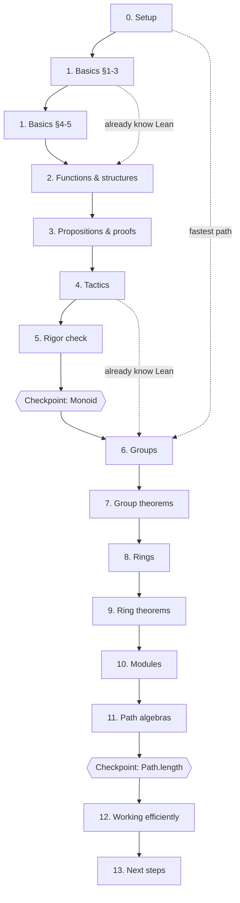

# Learning paths

[Table of contents](README.md)

---

Not every reader needs every chapter in order. This page maps out how the
chapters actually depend on one another, and suggests a handful of named
paths through the book for common starting points. All of them converge
by Chapter 6 — the dependency structure only really branches in Part I.

## Chapter dependency graph

Solid arrows are hard prerequisites (each chapter's Lean code and proofs
genuinely build on the one before it). The two checkpoint projects are
optional but recommended waypoints, not prerequisites — nothing later
in the book requires having done them. Dashed arrows are the two named
paths below that actually skip material outright, rather than just
reading it faster; the other two named paths change *how* a chapter is
read, not which chapters are read, so they have no edge of their own.

Chapter 5 is the one true fork: it exists to answer rigor questions
(`structure` vs `class`, universes, definitional vs propositional
equality) that a careful reader will already be asking by Chapter 4, but
a reader willing to take Lean's guarantees on faith for now can skip it
on a first pass and come back once something in Chapter 6 onward
prompts the question directly (each chapter's "Read more" boxes still
point back to the relevant §).

## Named paths

**Full path (recommended for a first read).** Chapters 0–13 in order,
checkpoint projects included. This is the path the book is written to
support directly — every forward reference assumes it.

**"I already know Lean, teach me the algebra."** Skim Chapter 0 (just
confirm your toolchain matches `v4.31.0`), read Chapter 1 §1–§3 for this
book's specific `Fin`/`Vec` examples, skip §4–§5 and Chapter 5 entirely
unless something later sends you back (the [Chapter 1 §4
glossary](01-basics/04-terminology.md) and [tactic and library
reference](tactic-and-library-reference.md) work as pure lookup tables
if a term is unfamiliar), then read Chapters 2–4 quickly for this book's
own conventions before Chapters 6–13 in full.

**"I already know abstract algebra, teach me Lean."** Read Chapters 0–5
in full — this is the actual Lean-specific content, and none of it
assumes algebra beyond what you already have. In Chapters 6–11, skim the
mathematical statements (you already know why the theorems are true) and
concentrate on *how* each is expressed and proved in Lean, plus the
"Mathlib equivalent" boxes; read Chapters 12–13 in full.

**"I want the formal foundations before anything else."** Read Chapter 1
in full, including §4–§5's calculus-of-constructions material, then
Chapter 3 §1–§2 for the logic recap, then Chapter 5 in full including
§3's typing rules — all before touching tactics or groups. This front-loads
everything Chapters 6 onward take for granted, at the cost of deferring
concrete payoff the longest.

**"I want to see Lean do real mathematics as fast as possible."** Read
Chapter 0 §1 ("Why Lean?"), then jump straight to Chapters 6–7 (`Group`),
referring back to Chapters 1–5 only when a specific term or tactic is
unfamiliar (the [Chapter 1 §4 glossary](01-basics/04-terminology.md) and
[tactic and library reference](tactic-and-library-reference.md) are
built exactly for this kind of lookup). Continue to Chapters 8–11, then
loop back and fill in whichever of Chapters 1–5 you skipped once you have
enough concrete motivation to want the "why."

Whichever path is chosen, the two checkpoint projects (after Chapter 5,
after Chapter 11) are a good self-test of whether to continue forward or
double back first.

---

[Table of contents](README.md)
