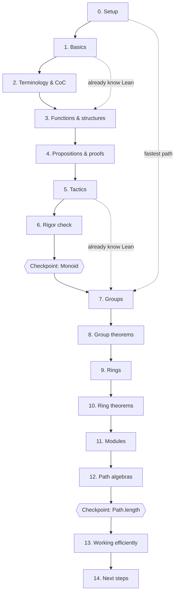

# Learning paths

[Table of contents](README.md)

---

Not every reader needs every chapter in order. This page maps out how the
chapters actually depend on one another, and suggests a handful of named
paths through the book for common starting points. All of them converge
by Chapter 7, since the dependency structure only really branches in Part I.

## Chapter dependency graph

```mermaid
graph TD
    C0["0. Setup"] --> C1["1. Basics"]
    C1 --> C2["2. Terminology & CoC"]
    C2 --> C3["3. Functions & structures"]
    C3 --> C4["4. Propositions & proofs"]
    C4 --> C5["5. Tactics"]
    C5 --> C6["6. Rigor check"]
    C6 --> CP1{{"Checkpoint: Monoid"}}
    CP1 --> C7["7. Groups"]
    C7 --> C8["8. Group theorems"]
    C8 --> C9["9. Rings"]
    C9 --> C10["10. Ring theorems"]
    C10 --> C11["11. Modules"]
    C11 --> C12["12. Path algebras"]
    C12 --> CP2{{"Checkpoint: Path.length"}}
    CP2 --> C13["13. Working efficiently"]
    C13 --> C14["14. Next steps"]
    C1 -.->|already know Lean| C3
    C5 -.->|already know Lean| C7
    C0 -.->|fastest path| C7
```

Solid arrows are hard prerequisites (the Lean code and proofs of each
chapter genuinely build on the one before it). The two checkpoint projects are
optional but recommended waypoints, not prerequisites; nothing later
in the book requires having done them. Dashed arrows are the two named
paths below that actually skip material outright, rather than just
reading it faster; the other two named paths change *how* a chapter is
read, not which chapters are read, so they have no edge of their own.

Chapter 6 is the one true fork. It exists to answer rigor questions
(`structure` vs `class`, universes, definitional vs propositional
equality) that a careful reader will already be asking by Chapter 5, but
a reader willing to take the guarantees of Lean on faith for now can skip
Chapter 6 on a first pass and come back once something in Chapter 7 onward
prompts the question directly (the "Read more" boxes of each chapter still
point back to the relevant section).

## Named paths

**Full path (recommended for a first read).** Chapters 0–14 in order,
checkpoint projects included. This is the path the book is written to
support directly, and every forward reference assumes it.

**"I already know Lean, teach me the algebra."** Skim Chapter 0 (just
confirm your toolchain matches `v4.32.2`), read Chapter 1 for the
specific `Fin`/`Vec` examples of this book, skip Chapter 2 (terminology
and the calculus of constructions) and Chapter 6 (rigor check) entirely
unless something later sends you back (the [Chapter 2, Section 1
glossary](02-terminology-and-coc/01-terminology.md) and [tactic and library
reference](tactic-and-library-reference.md) work as pure lookup tables
if a term is unfamiliar), then read Chapters 3–5 quickly for the own
conventions of the book before Chapters 7–14 in full.

**"I already know abstract algebra, teach me Lean."** Read Chapters 0–6
in full, since this is the actual Lean-specific content, and none of it
assumes algebra beyond what you already have. In Chapters 7–12, skim the
mathematical statements (you already know why the theorems are true) and
concentrate on *how* each is expressed and proved in Lean, plus the
"Mathlib equivalent" boxes; read Chapters 13–14 in full.

**"I want the formal foundations before anything else."** Read Chapters
1–2 in full (Chapter 2 is exactly the calculus-of-constructions
material), then Chapter 4, Sections 1–2 for the logic recap, then
Chapter 6 in full including the typing rules of Section 3, all before
touching tactics or groups. This front-loads everything Chapters 7
onward take for granted, at the cost of deferring concrete payoff the
longest.

**"I want to see Lean do real mathematics as fast as possible."** Read
Chapter 0, Section 1 ("Why Lean?"), then jump straight to Chapters 7–8 (`Group`),
referring back to Chapters 1–6 only when a specific term or tactic is
unfamiliar (the [Chapter 2, Section 1 glossary](02-terminology-and-coc/01-terminology.md) and
[tactic and library reference](tactic-and-library-reference.md) are
built exactly for this kind of lookup). Continue to Chapters 9–12, then
loop back and fill in whichever of Chapters 1–6 you skipped once you have
enough concrete motivation to want the "why."

Whichever path is chosen, the two checkpoint projects (after Chapter 6,
after Chapter 12) are a good self-test of whether to continue forward or
double back first.

---

[Table of contents](README.md)
